## Programming the Bot

#### Clone the project from GitHub repo

`git clone https://github.com/Microsoft/app-innovation-team.git`

#### Using Visual Studio 2019 (any version)

1. Go `walkthrough-bot-dotnet\source\1. start\` folder and open the WBD.sln file in Visual Studio 2019.

2. Wait until nuget packages are restored.

3. Build the WBD project (the project should be successfully compiled, but is not ready to be executed).

#### Using Visual Studio Code (any version)

1. Open Visual Studio Code and open the following folder `walkthrough-bot-dotnet\source\1. start\WBD\`.

2. Open a terminal, navigate to the folder `walkthrough-bot-dotnet\source\1. start\WBD\` and run the following command: <b>dotnet build</b>, wait until nuget packages are restored and the project finishes the build process (the project should be successfully compiled but is not ready to be executed).

#### Translator text configuration

Go to https://portal.azure.com/ and sign-in with your Employee or Microsoft account.

Steps:

1. Create a Translator Text resource with the following configuration:

    - Name: translator(uniqueid) e.g. translator017.
    - Subscription: your subscription.
    - Pricing tier: S1 (Pay as you go).
    - Resource Group: Create new with the same resource name, e.g. translator017-RG.

    <div style="text-align:left">
        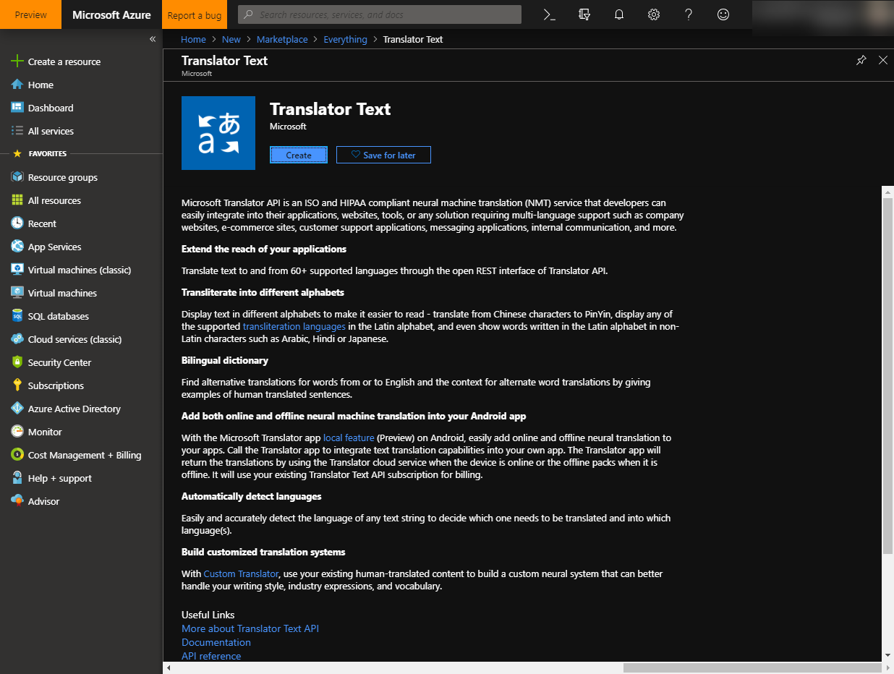
        <br />
        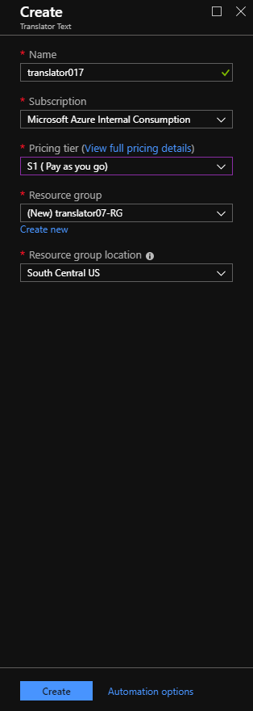
        <br />
    </div>

2. Once the resource has been deployed go to the resource and click in <b>Resource Management->Keys</b> and take note of the `Key 1` in a notepad (we are going to use this information later to configure the bot).

    <div style="text-align:left">
        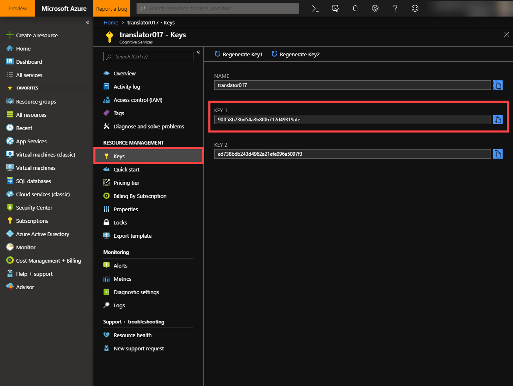
        <br />
    </div>

#### LUIS configuration

1. Go to https://www.luis.ai/ and get successfully sign-in with your Employee or Microsoft account.

    <div style="text-align:left">
        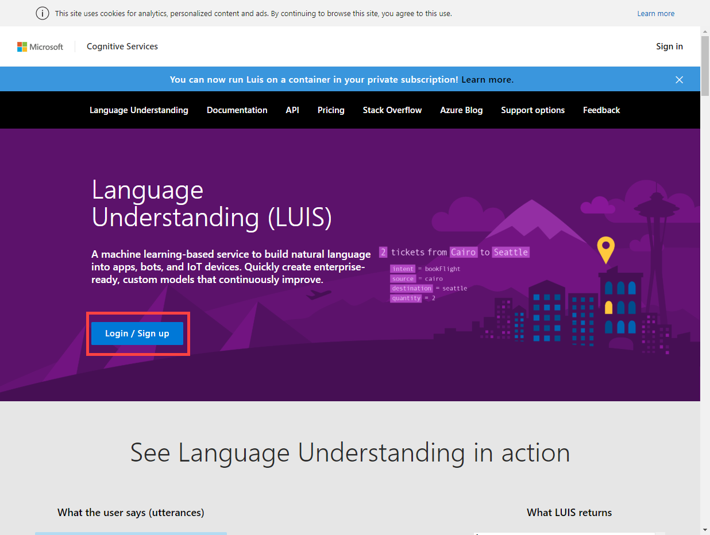
        <br />
    </div>

2. Once you are signed-in, go to My Apps and click `Import new app`, select the file: Reminders.json located in the folder `walkthrough-bot-dotnet\source\3. models\` and finally click done.

    <div style="text-align:left">
        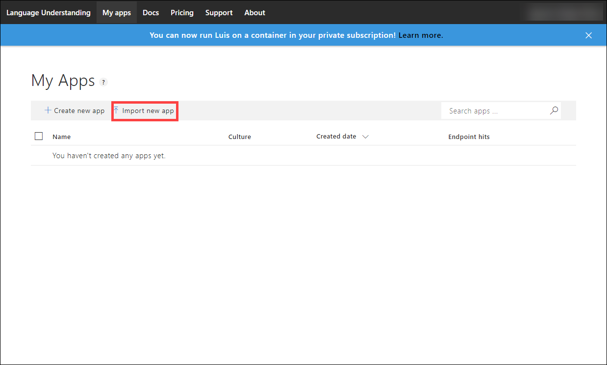
        <br />
        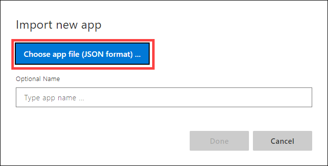
        <br />
        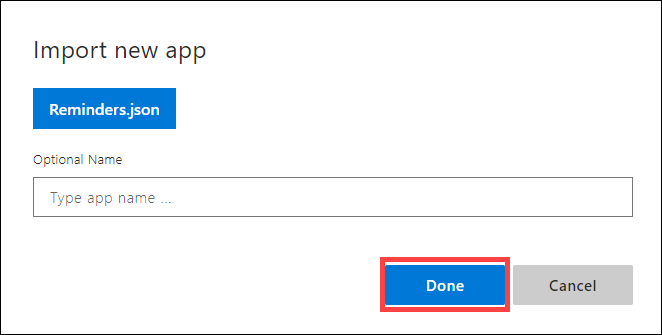
        <br />
    </div>

3. A new LUIS application has been created (this application contains three intents: Calendar.Add,Calendar.Find and None, each intent has been filled with a bunch of utterances as an example).

    <div style="text-align:left">
        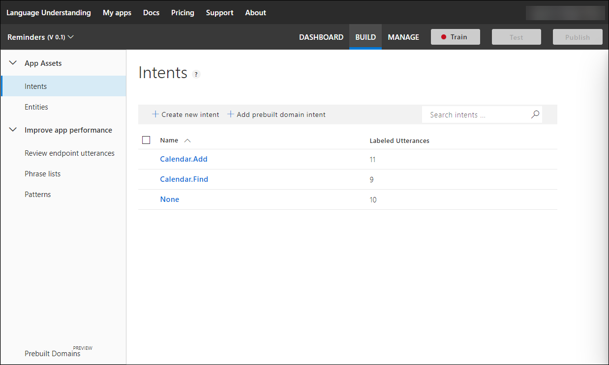
        <br />
    </div>

4. Go to Reminders app and click on Train button, once you have trained the model click Publish to make public the API service. Select a Production environment value.

    <div style="text-align:left">
        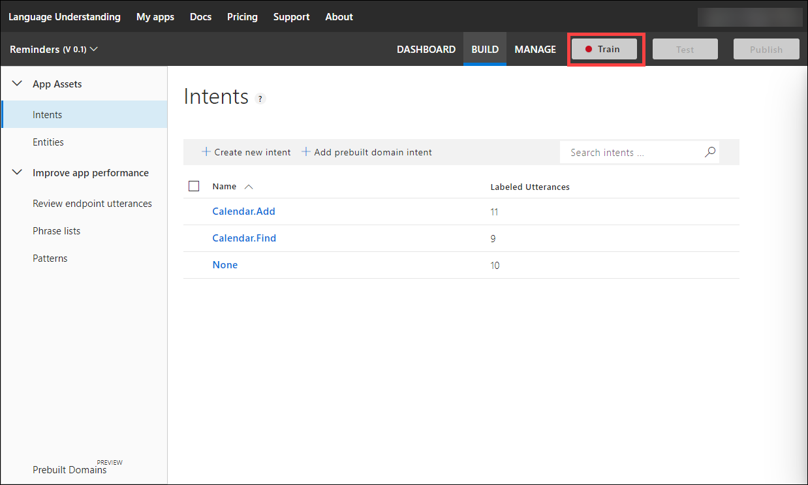
        <br />
        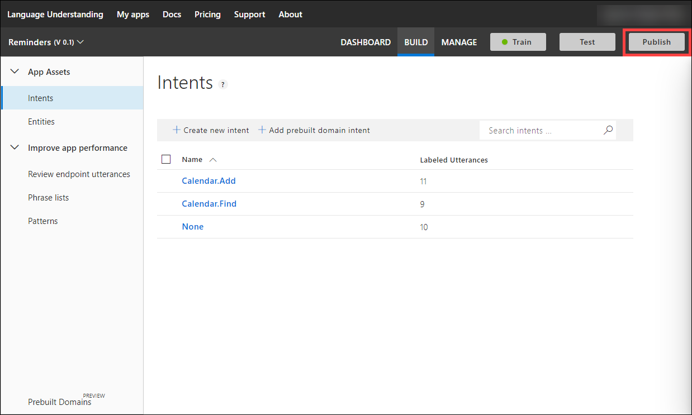
        <br />
        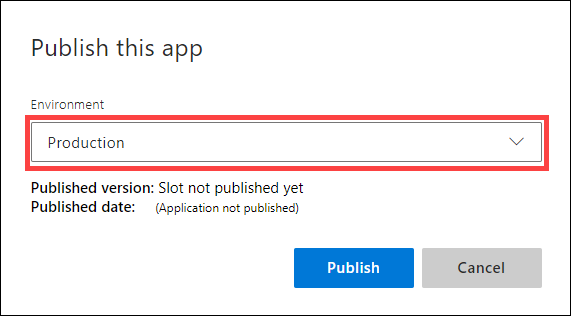
        <br />
    </div>

5. Once the service has been trained and published go to manage and take note of the `Application ID (from Application Information tab)`, `Authoring Key (from Keys and Endpoints tab)`, `Endpoint (from Keys and Endpoints tab)` in a notepad (we are going to use this information later to configure the bot).

    <div style="text-align:left">
        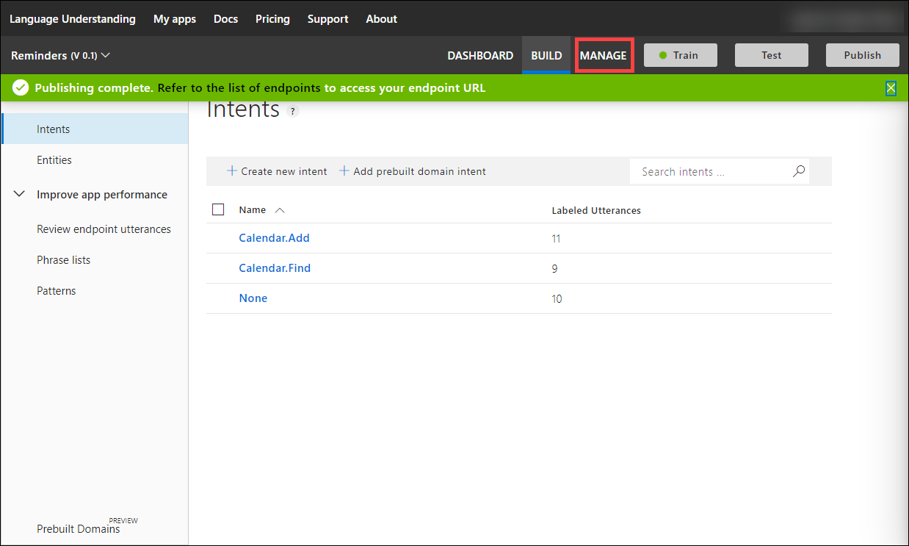
        <br />
        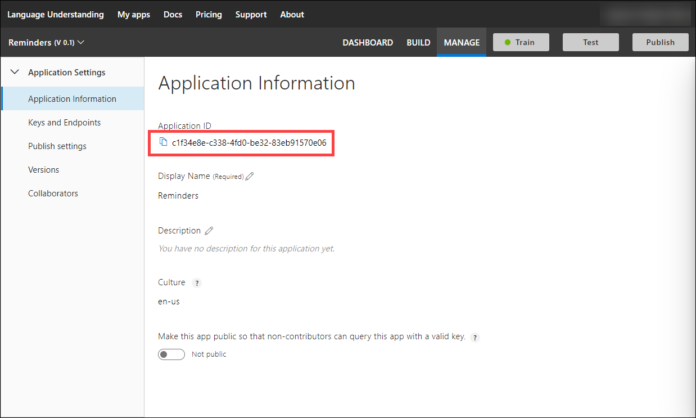
        <br />
        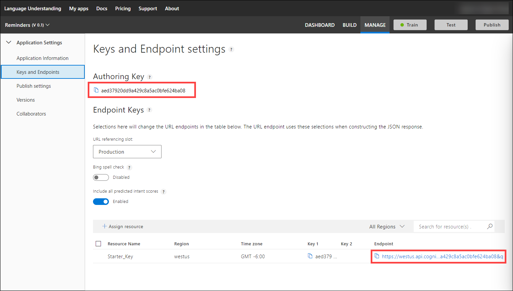
        <br />
    </div>

6. Everytime you add, remove or update utterances a new train and publish process is required to train and expose the latest version.

#### Bot configuration

Return to Visual Studio 2019 or Visual Studio Code open and update the `appsettings.json` file in the root of the bot project.

Your appsettings.json file should look like this
```json
{
    "MicrosoftAppId": "MICROSOFT_BOT_APP_ID",
    "MicrosoftAppPassword": "MICROSOFT_BOT_APP_PASSWORD",
    "TranslatorTextAPIKey": "AZURE_TRANSLATOR_KEY",
    "BotVersion": "BOT_VERSION",
    "LuisName01": "LUIS_NAME (e.g. Reminders)",
    "LuisAppId01": "LUIS_APPLICATION_ID",
    "LuisAuthoringKey01": "LUIS_AUTHORING_KEY",
    "LuisEndpoint01": "LUIS_ENDPOINT"
}
```

<b>Note:</b> For local development and debugging MicrosoftAppId and MicrosoftAppPassword MUST be empty, these settings are used in Azure deployment.

#### Getting dirty (let's code!)

1. In the Startup.cs file, search for: `// TODO: ADD SETTINGS` and replace the line with:

    ```csharp
    Settings.MicrosoftAppId = Configuration.GetSection("MicrosoftAppId")?.Value;
    Settings.MicrosoftAppPassword = Configuration.GetSection("MicrosoftAppPassword")?.Value;
    Settings.TranslatorTextAPIKey = Configuration.GetSection("TranslatorTextAPIKey")?.Value;
    Settings.BotVersion = Configuration.GetSection("BotVersion")?.Value;
    Settings.LuisAppId01 = Configuration.GetSection("LuisAppId01")?.Value;
    Settings.LuisName01 = Configuration.GetSection("LuisName01")?.Value;
    Settings.LuisAuthoringKey01 = Configuration.GetSection("LuisAuthoringKey01")?.Value;
    Settings.LuisEndpoint01 = Configuration.GetSection("LuisEndpoint01")?.Value;
    ```
    <b>Note:</b> This code provides the correct settings from the `appsettings.json` file.

2. In the Startup.cs file, search for: `// TODO: ADD ACCESSOR CONFIGURATION` and replace the line with:

    ```csharp
    services.AddSingleton(sp =>
    {
        // We need to grab the conversationState we added on the options in the previous step
        var options = sp.GetRequiredService<IOptions<BotFrameworkOptions>>().Value;
        if (options == null)
        {
            throw new InvalidOperationException("BotFrameworkOptions must be configured prior to setting up the State Accessors");
        }

        var conversationState = options.State.OfType<ConversationState>().FirstOrDefault();
        if (conversationState == null)
        {
            throw new InvalidOperationException("ConversationState must be defined and added before adding conversation-scoped state accessors.");
        }

        var userState = options.State.OfType<UserState>().FirstOrDefault();
        if (userState == null)
        {
            throw new InvalidOperationException("UserState must be defined and added before adding user-scoped state accessors.");
        }

        var luisServices = new Dictionary<string, LuisRecognizer>();
        var app = new LuisApplication(Settings.LuisAppId01, Settings.LuisAuthoringKey01, Settings.LuisEndpoint01);
        var recognizer = new LuisRecognizer(app);
        luisServices.Add(Settings.LuisName01, recognizer);

        // Create the custom state accessor.
        // State accessors enable other components to read and write individual properties of state.
        var accessors = new BotAccessors(conversationState, userState, luisServices)
        {
            ConversationDialogState = conversationState.CreateProperty<DialogState>("DialogState"),
            LanguagePreference = userState.CreateProperty<string>("LanguagePreference"),
            IsReadyForLUISPreference = userState.CreateProperty<bool>("IsReadyForLUISPreference")
        };

        return accessors;
    });
    ```

    <b>Note:</b> These changes provides the correct configuration required to consume LUIS service from the bot and configure the accessor object, in addition, provides the correct configuration for the accessors, LanguagePreference and IsReadyForLUISPreference will be use as part of the userState object.

3. In the Bot.cs file, search for: `// TODO: BEGIN INITIAL DIALOG` and replace the line with:

    ```csharp
    await dialogContext.BeginDialogAsync("MainDialog", null, cancellationToken);
    ```

    <b>Note:</b> This code provides the initialization for the first dialog in the bot, everything starts from here.

6. In the Bot.cs file, search for: `// TODO: RESET DIALOG` and replace the line with:

    ```csharp
    await accessors.IsReadyForLUISPreference.DeleteAsync(turnContext);
    await accessors.LanguagePreference.DeleteAsync(turnContext);
    await dialogContext.EndDialogAsync();
    await dialogContext.BeginDialogAsync("MainDialog", null, cancellationToken);
    ```

    <b>Note:</b> This code provides the end and begin of the dialog, deleting all values from preferences.

7. In the Bot.cs file, search for: `// TODO: CONFIGURE LUIS` and replace the line with:

    ```csharp
    string userLanguage = await accessors.LanguagePreference.GetAsync(turnContext, () => { return string.Empty; });
    turnContext.Activity.Text = await TranslatorHelper.TranslateSentenceAsync(turnContext.Activity.Text, userLanguage, "en");
    await turnContext.SendActivityAsync($"Sending to LUIS -> {turnContext.Activity.Text}");

    // LUIS
    var recognizerResult = await accessors.LuisServices[Settings.LuisName01].RecognizeAsync(turnContext, cancellationToken);
    var topIntent = recognizerResult?.GetTopScoringIntent();
    if (topIntent != null && topIntent.HasValue && topIntent.Value.intent != "None")
    {
        await ProcessIntentAsync(turnContext, topIntent.Value.intent, topIntent.Value.score, cancellationToken);
    }
    else
    {
        var response = @"No LUIS intents were found.";
        var message = await TranslatorHelper.TranslateSentenceAsync(response, "en", userLanguage);
        await turnContext.SendActivityAsync(message);
    }
    ```

    <b>Note:</b> This code provides the configuration required to call LUIS service using the Bot Builder SDK identify the correct top intent and the top score related with the utterance sent.

8. In the Bot.cs file, search for: `// TODO: ADD ANIMATION CARD` and replace the line with:

    ```csharp
    animationCard = new AnimationCard
    {
    Title = $"Intent: {intent}",
    Subtitle = $"Score: {score}",
    Media = new List<MediaUrl>
    {
        new MediaUrl()
        {
            Url = "https://i.gifer.com/HwZb.gif",
        },
    },
    };

    reply.Attachments.Add(animationCard.ToAttachment());
    ```

    <b>Note:</b> This code provides the animation card for Calendar_Add intent.

9. In the dialogs\LanguageDialog.cs file, search for: `// TODO: ADD WATERFALLDIALOGS` and replace the line with:

    ```csharp
    RequestPhraseDialog,
    ResponsePhraseDialog,
    EndLanguageDialog
    ```

    <b>Note:</b> This code provides the waterfall sequence that will be executed by the LanguageDialog.

10. In the dialogs\LanguageDialog.cs file, search for: `// TODO: ADD PROMPT VALIDATIONS` and replace the line with:

    ```csharp
    if (promptContext.Recognized.Value == null)
    {
        await promptContext.Context.SendActivityAsync($"Sorry, but I'm expecting an string, send me another phrase");
    }
    else
    {
        var value = promptContext.Recognized.Value;
        if (value.Length < 4)
        {
            await promptContext.Context.SendActivityAsync("Your phrase must be at least 4 characters long");
        }
        else
        {
            return true;
        }
    }
    ```

    <b>Note:</b> This code provides the validations required for the prompt used in RequestPhraseDialog.

11. In the dialogs\LanguageDialog.cs file, search for: `// TODO: SAVE DIALOG PREFERENCES` and replace the line with:

    ```csharp
    await accessors.LanguagePreference.SetAsync(step.Context, step.ActiveDialog.State["language"].ToString());
    await accessors.IsReadyForLUISPreference.SetAsync(step.Context, true);
    await accessors.UserState.SaveChangesAsync(step.Context, false, cancellationToken);
    ```

    <b>Note:</b> This code provides the routine to save the preferences before end the LanguageDialog and return to MainDialog.

#### Running the bot

Congratulations! if you are here is because your bot is almost done, you only need to verify the configuration of the ports, run the bot app and open the WBD.bot file from the emulator.

Before continue please open the WBD.csproj properties and validate the correct port: 

- Project Properties -> Debug -> Web Server Settings -> App Url: `http://localhost:3978/`.

- Now, open the file WBD.bot located in the root of the project and verify the line 9: `"endpoint": "http://localhost:3978/api/messages"`.

<b>Note:</b> Both configuration are pointing to localhost and the same port 3978 as default, you can set a new port in both places in case you need it.

Run your bot app and wait the web application be launched then open the Bot Framework Emulator and open the WBD.bot file you previously configured.

<div style="text-align:center">
    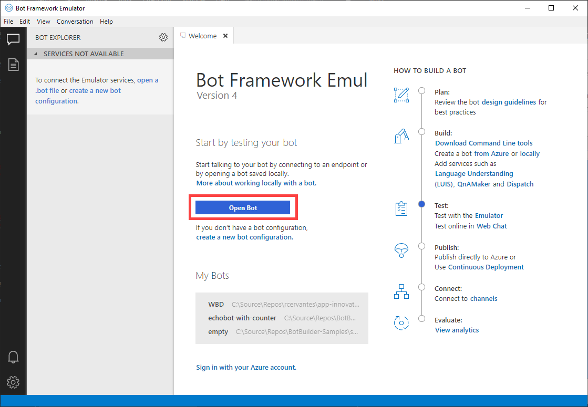
</div>

In the Bot Framework Emulator you will see an Endpoint called: Local, click it and your bot should be starting with the initial phrase configured in your dialog.

<div style="text-align:center">
    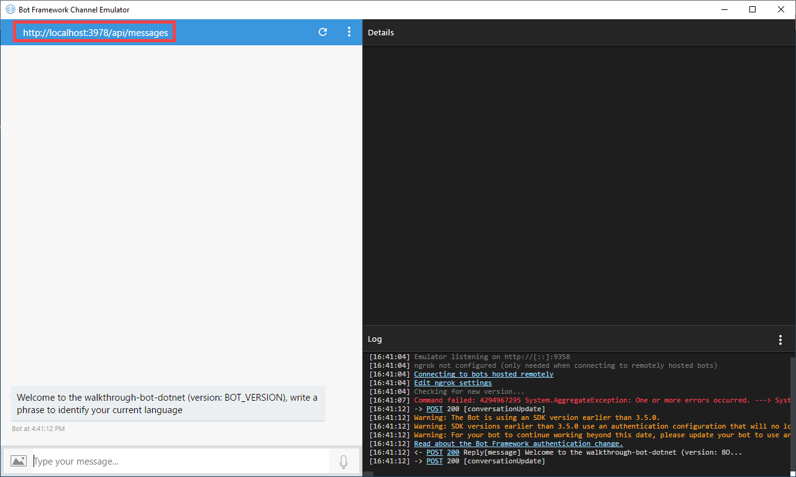
</div>

#### Troubleshooting

If you have issues with your emulator, verify you have unchecked the option: Bypass ngrok for local address located in emulator settings. 

#### Master code (complete solution)

In case you want to review your code with the complete solution you can follow the previous configuration steps using the complete solution located in: `walkthrough-bot-dotnet\source\2. completed\WBD\`.