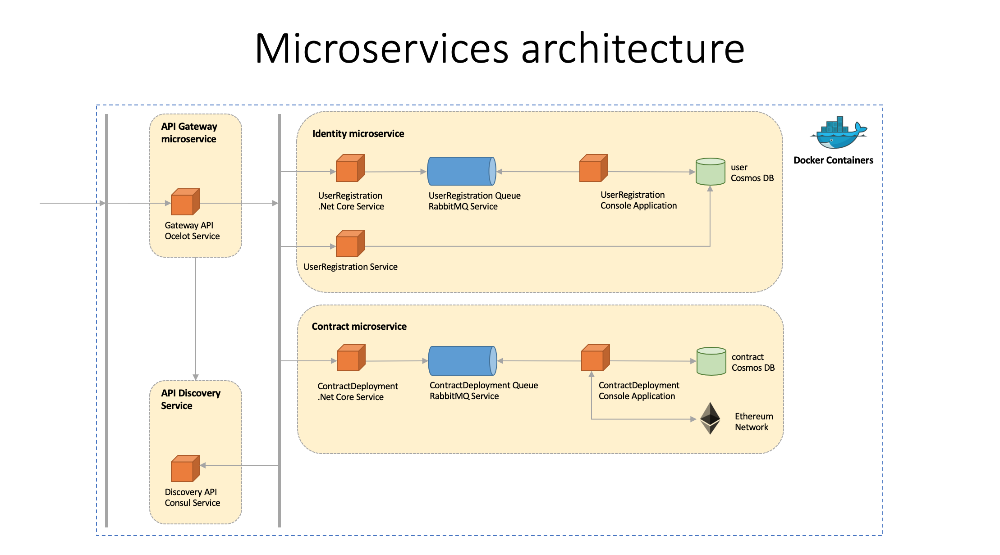
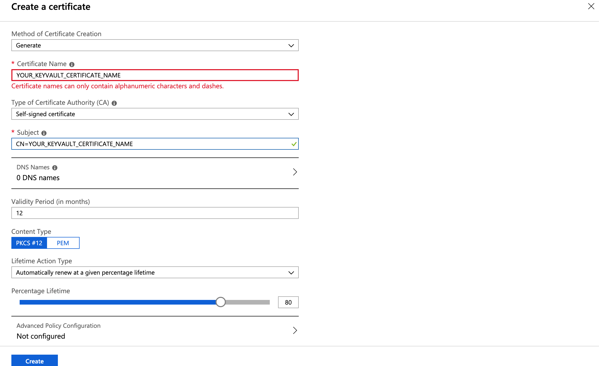
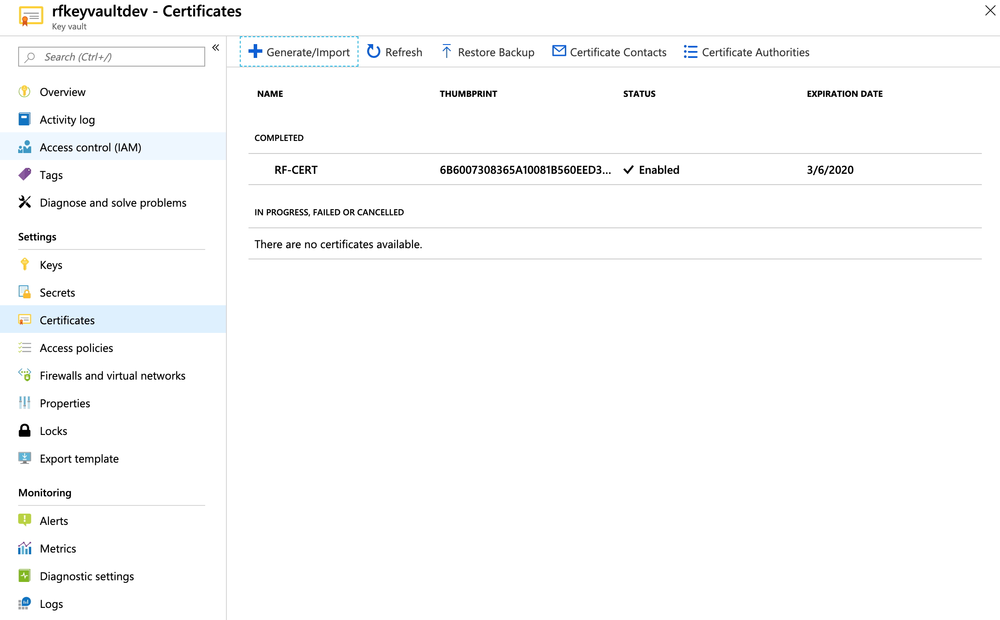
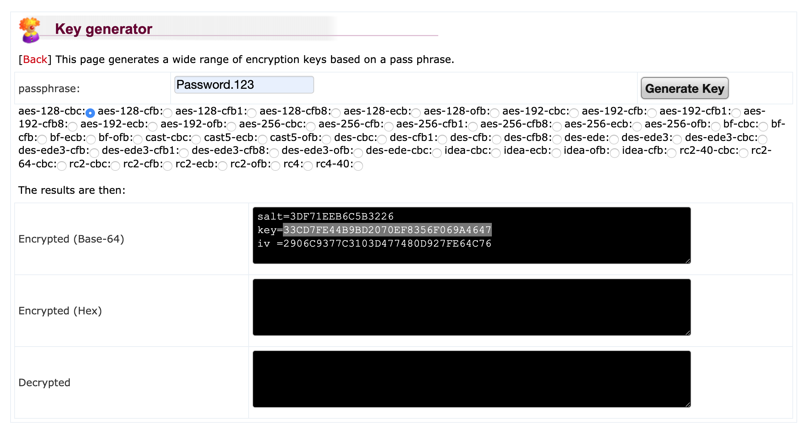
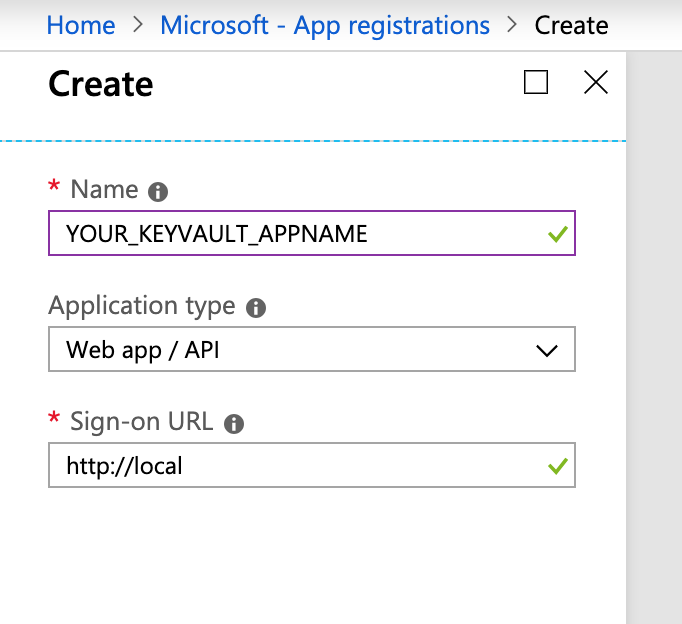
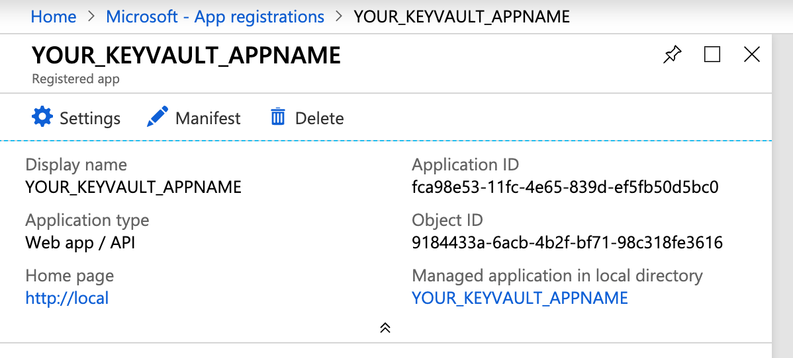
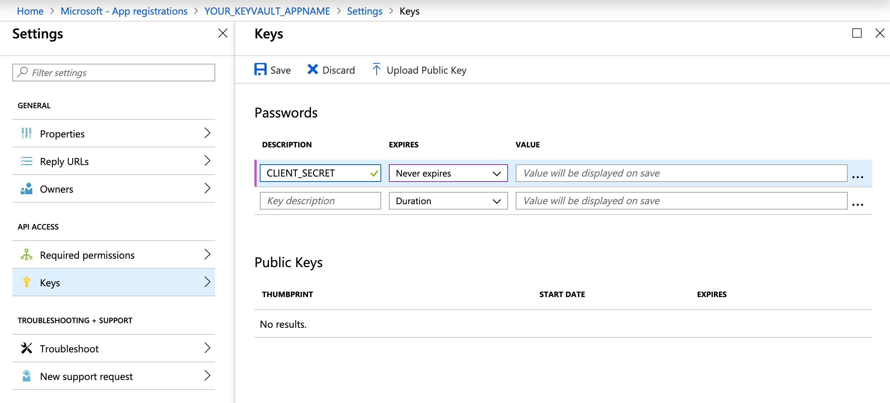
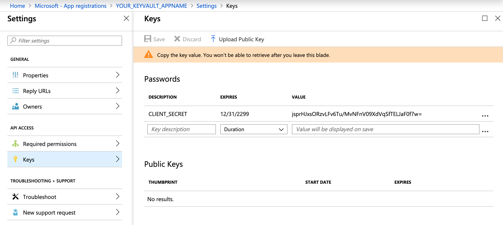
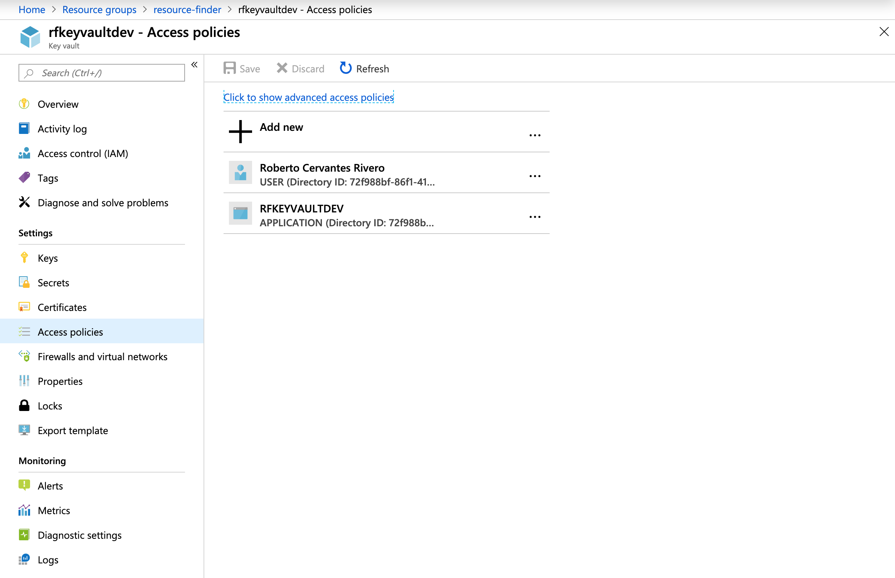
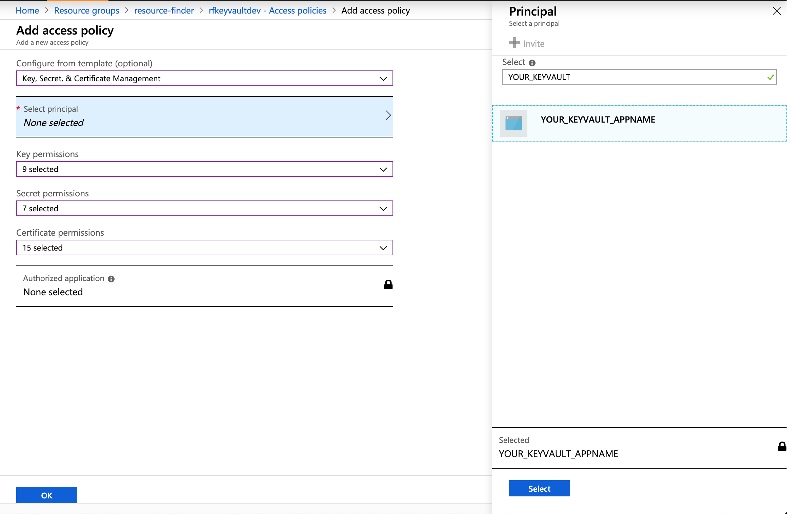

# Intro

Microservices baseline has the intent to show how we can build an .NET Core microservices solution using a bunch of containerized services.

## Services implemented

The solution is splitted in the following services:

- API Gateway (web)
- Discovery Service (web)
- AMQP Service (web | backend)
- Identity API (web)
- UserRegistration APP (console app)
- Contracts API (web)
- ContractDeployment APP (console app)

## Technology stack used

- Docker
- Azure CosmosDB (MongoDB)
- Azure KeyVault
- Ethereum on Azure
- Nethereum
- SendGrid on Azure
- RabbitMQ 
- Consul
- Ocelot
- Microservices using .NET Core

## Architecture

<div style="text-align:center">
    
</div>

## Running the project

To run the project locally you need:

- Visual Studio 2017 / 2019
- Visual Studio Code (optional)
- Docker (latest version)
- Docker Compose (latest version)
- Net Core 2.2 SDK
- Optional: you may want to install CTOP if you are using Linux/MacOS to manage containers from your terminal: https://github.com/bcicen/ctop

<b>Important:</b> The current microservices solution is optimized to run on Linux/MacOS, it means I’m using a specific configuration in the code to handle IO directly with libuv unix sockets, said that, I would suggest host Docker on MacOS or Linux VM, otherwise you will need to perform some adjustments in the code to add IIS service on Program.cs on each API exposed.

### Docker Compose

Docker Compose is a container orchestrator for deployments in one single node, you can scale and create memory boundaries cross the containerized services. To run the full project in one single execution you will need to have installed Docker Compose, this solution was tested on: version 1.23.2.

### .NET Core Certificate

Create a certificate in your development or deployment machine with the name: YOUR_CERTIFICATE_NAME and then specify the password: YOUR_CERTIFICATE_PASSWORD, use this link to perform the configuration using net core: https://github.com/dotnet/dotnet-docker/blob/master/samples/aspnetapp/aspnetcore-docker-https.md.
 
### Database

Microservices are prepared to have isolated databases, however, for development or testing purposes we can use a single database MongoDB on CosmosDB, create a new database for this solution, in case you need more information check this site: https://docs.microsoft.com/en-us/azure/cosmos-db/create-mongodb-dotnet, you will need the MongoDB connection string to configure each service in Docker-Compose.

### Ethereum Blockchain

We need to install and configure Ethereum on Azure, since we are going to deploy our smart-contract in our private blockchain. You will find the ABI Contract and ABI ByteCode on the current docker-compose file but you will need to configure your own RPC address. 

If it's the first time you are configuring Ethereum on Azure, read this resource: https://docs.microsoft.com/en-us/azure/blockchain/templates/ethereum-poa-deployment.

Follow the deployment steps but in the Ethereum Settings add the following admin address: `0xd10c8A96D79618Ab3C38A962db74DFBe47e24300`, it's important you add this address since you will need it's own private key further.

```
For testing purposes we are going to use the following admin address.

Wallet: 0xd10c8A96D79618Ab3C38A962db74DFBe47e24300

Private Key: 2eeb29d0f32bd47325139a095f88302c3a134cac8125ca029159b148746437cc
```

Once the Ethereum on Azure resource is deployed you will be able to see the Deployment output -> Ethereum RPC endpoint, you will need this for the Docker Compose configuration.

### SendGrid 

We need to install and configure SendGrid to allow microservices send emails, if it's the first time you are configuring SendGrid, read this resource: https://docs.microsoft.com/en-us/azure/sendgrid-dotnet-how-to-send-email, you will need the API key for the Docker Compose configuration.

### RabbitMQ

RabbitMQ will be automatically downloaded and configured by Docker, you will be able to access through the portal using: http://localhost:15672, with username: guest, password: guest. For development and testing purposes we are going to use the same predefined username and password, in case you need to change the username and password check this: https://onlinehelp.coveo.com/en/ces/7.0/administrator/changing_the_rabbitmq_administrator_password.htm.

### Consul

Consul will be automatically downloaded and configured by Docker, you will be able to access through the portal using: http://localhost:8500, you will be able to see your microservices nodes. This service is responsible to notify to API Gateway any IP and Port changes in the containers.

### Azure Key Vault

Azure Key Vault is one of the most important pieces in the solution, providing storage to the secrets used for encryption, RabbitMQ use an Azure Key Vault secret key to encrypt all messages stored in queues and console apps use the same secret key to decrypt and process messages.

Create a new Azure Key Vault, if you don't know how to create the resource check this: https://docs.microsoft.com/en-us/azure/key-vault/quick-create-portal.

#### Azure Key Vault Certificate

Now it's time to configure the certificate in Key Vault.

Go to your Key Vault resource, click Certificates and Generate/Import, then write the certificate name and subject, finally click create.

<div style="text-align:center">
    
</div>

You will now be able to see the certificate, this will be your <b>KeyVaultCertificateName</b>.

<div style="text-align:center">
    
</div>

#### Azure Key Vault Identifier

Go to your Key Vault resource, click Overview and copy the DNS Name this will be your <b>KeyVaultIdentifier</b>.

#### Azure Key Vault Encryption Key

Once the Azure resource has been created add the <b>KeyVaultEncryptionKey</b> secret.

- Name: YOUR_KEYVAULT_ENCRYPTION_SECRET
- Value: 33CD7FE44B9BD2070EF8356F069A4647

Yo can use this site to generate a new AES encryption key that will be use as value in the secret: https://asecuritysite.com/encryption/keygen.

<div style="text-align:center">
    
</div>

#### Azure Key Vault Client App Id

Go to Azure Active Directory resource and click in App Registrations, then click in New application registration, fill the fields and click create.

<div style="text-align:center">
    
</div>

Take note of Application ID, this will be your <b>KeyVaultClientId</b>.

<div style="text-align:center">
    
</div>

Now let's configure the Key settings.

Click Settings then Keys, add the following fields and save it.

- DESCRIPTION: CLIENT_SECRET
- EXPIRES: Never expires 

<div style="text-align:center">
    
</div>

Once you save the key a value will appear, take note of this value because we are going to use it later in your  <b>KeyVaultClientSecret</b>.

<div style="text-align:center">
    
</div>

#### Link Azure Active Directory Application to Azure Key Vault 

Finally, you need to link your Azure Active Directory Application to your Key Vault resource.

Go to your Key Vault resource, click Access policies and add new.

<div style="text-align:center">
    
</div>

Select your Azure Active Directoy Application and click Ok.

<div style="text-align:center">
    
</div>

Perfect, now you have configured successfully your Azure Key Vault account to work with the microservices.

### Docker Compose configuration

Clone the repo and configure the docker-compose.yml file located in: microservices-baseline\source\Services\docker-compose.yml.

```
version: '2.4'

services:
  gateway:
    image: rf.gateway.api:1.0
    mem_limit: 500M
    logging:
      driver: "json-file"
      options:
        max-size: "50m"
    hostname: gateway
    environment:
        - ASPNETCORE_ENVIRONMENT=Production
        - ASPNETCORE_URLS=https://+;http://+
        - ASPNETCORE_Kestrel__Certificates__Default__Password=YOUR_CERTIFICATE_PASSWORD
        - ASPNETCORE_Kestrel__Certificates__Default__Path=/https/YOUR_CERTIFICATE_NAME.pfx
    volumes:
      - ${HOME}/.aspnet/https:/https/
    build:
      context: .
      dockerfile: RF.Gateway.Api/Dockerfile
    ports:
      - "17070:443"
    restart: always
    depends_on:
      - consul  
  identity-api:
    image: rf.identity.api:1.0
    mem_limit: 250M
    logging:
      driver: "json-file"
      options:
        max-size: "50m"
    hostname: identity-api
    environment:
        - ASPNETCORE_ENVIRONMENT=Production
        - ASPNETCORE_URLS=https://+;http://+
        - ASPNETCORE_Kestrel__Certificates__Default__Password=YOUR_CERTIFICATE_PASSWORD
        - ASPNETCORE_Kestrel__Certificates__Default__Path=/https/YOUR_CERTIFICATE_NAME.pfx
        - AuthorizationKey=YOUR_AUTHORIZATION_KEY (e.g. 24a406e2-98d3-4093-b123-db22fabc1601)
        - ConnectionString=YOUR_MONGODB_CONNECTION_STRING
        - DatabaseId=YOUR_MONGODB_DATABASEID
        - UserCollection=user
        - RabbitMQUsername=guest
        - RabbitMQPassword=guest
        - RabbitMQHostname=rabbit
        - RabbitMQPort=5672
        - UserRegistrationQueueName=users
        - KeyVaultCertificateName=YOUR_KEYVAULT_CERTIFICATE_NAME
        - KeyVaultClientId=YOUR_KEYVAULT_CLIENT_ID
        - KeyVaultClientSecret=YOUR_KEYVAULT_CLIENT_SECRET
        - KeyVaultIdentifier=https://YOUR_KEYVAULT_IDENTIFIER.vault.azure.net
        - KeyVaultEncryptionKey=YOUR_KEYVAULT_ENCRYPTION_SECRET
    volumes:
      - ${HOME}/.aspnet/https:/https/
    build:
      context: .
      dockerfile: RF.Identity.Api/Dockerfile
    ports:
      - "443"
    restart: always
    depends_on:
      - consul
  userregistration-app:
    image: rf.userregistration.app:1.0
    mem_limit: 200M
    logging:
      driver: "json-file"
      options:
        max-size: "50m"
    hostname: userregistration-app
    environment:
        - ASPNETCORE_ENVIRONMENT=Production
        - ConnectionString=YOUR_MONGODB_CONNECTION_STRING
        - DatabaseId=YOUR_MONGODB_DATABASEID
        - UserCollection=user
        - RabbitMQUsername=guest
        - RabbitMQPassword=guest
        - RabbitMQHostname=rabbit
        - RabbitMQPort=5672
        - UserRegistrationQueueName=users
        - KeyVaultCertificateName=YOUR_KEYVAULT_CERTIFICATE_NAME
        - KeyVaultClientId=YOUR_KEYVAULT_CLIENT_ID
        - KeyVaultClientSecret=YOUR_KEYVAULT_CLIENT_SECRET
        - KeyVaultIdentifier=https://YOUR_KEYVAULT_IDENTIFIER.vault.azure.net
        - KeyVaultEncryptionKey=YOUR_KEYVAULT_ENCRYPTION_SECRET
        - SendGridAPIKey=YOUR_SENDGRID_APIKEY
    volumes:
      - ${HOME}/.aspnet/https:/https/
    build:
      context: .
      dockerfile: RF.UserRegistration.App/Dockerfile
    restart: always
    depends_on:
      rabbit:
        condition: service_healthy
  contracts-api:
    image: rf.contracts.api:1.0
    mem_limit: 250M
    logging:
      driver: "json-file"
      options:
        max-size: "50m"
    hostname: contracts-api
    environment:
        - ASPNETCORE_ENVIRONMENT=Production
        - ASPNETCORE_URLS=https://+;http://+
        - ASPNETCORE_Kestrel__Certificates__Default__Password=YOUR_CERTIFICATE_PASSWORD
        - ASPNETCORE_Kestrel__Certificates__Default__Path=/https/YOUR_CERTIFICATE_NAME.pfx
        - AuthorizationKey=YOUR_AUTHORIZATION_KEY (e.g. 24a406e2-98d3-4093-b123-db22fabc1601)
        - ConnectionString=YOUR_MONGODB_CONNECTION_STRING
        - DatabaseId=YOUR_MONGODB_DATABASEID
        - ContractCollection=contract
        - RabbitMQUsername=guest
        - RabbitMQPassword=guest
        - RabbitMQHostname=rabbit
        - RabbitMQPort=5672
        - ContractDeploymentQueueName=contracts
        - KeyVaultCertificateName=YOUR_KEYVAULT_CERTIFICATE_NAME
        - KeyVaultClientId=YOUR_KEYVAULT_CLIENT_ID
        - KeyVaultClientSecret=YOUR_KEYVAULT_CLIENT_SECRET
        - KeyVaultIdentifier=https://YOUR_KEYVAULT_IDENTIFIER.vault.azure.net
        - KeyVaultEncryptionKey=YOUR_KEYVAULT_ENCRYPTION_SECRET
    volumes:
      - ${HOME}/.aspnet/https:/https/
    build:
      context: .
      dockerfile: RF.Contracts.Api/Dockerfile
    ports:
      - "443"
    restart: always
    depends_on:
      - consul
  contractdeployment-app:
    image: rf.contractdeployment.app:1.0
    mem_limit: 200M
    logging:
      driver: "json-file"
      options:
        max-size: "50m"
    hostname: contractdeployment-app
    environment:
        - ASPNETCORE_ENVIRONMENT=Production
        - ConnectionString=YOUR_MONGODB_CONNECTION_STRING
        - DatabaseId=YOUR_MONGODB_DATABASEID
        - ContractCollection=contract
        - RabbitMQUsername=guest
        - RabbitMQPassword=guest
        - RabbitMQHostname=rabbit
        - RabbitMQPort=5672
        - ContractDeploymentQueueName=contracts
        - KeyVaultCertificateName=YOUR_KEYVAULT_CERTIFICATE_NAME
        - KeyVaultClientId=YOUR_KEYVAULT_CLIENT_ID
        - KeyVaultClientSecret=YOUR_KEYVAULT_CLIENT_SECRET
        - KeyVaultIdentifier=https://YOUR_KEYVAULT_IDENTIFIER.vault.azure.net
        - KeyVaultEncryptionKey=YOUR_KEYVAULT_ENCRYPTION_SECRET
        - BlockchainRPCUrl=YOUR_ETHEREUM_RPC (e.g. http://xxxx.region.cloudapp.azure.com:8540)
        - BlockchainMasterAddress=0xd10c8A96D79618Ab3C38A962db74DFBe47e24300
        - BlockchainMasterPrivateKey=2eeb29d0f32bd47325139a095f88302c3a134cac8125ca029159b148746437cc
        - BlockchainContractABI=[{'constant':true,'inputs':[{'name':'id','type':'bytes32'}],'name':'GetRecord','outputs':[{'name':'','type':'bytes32'},{'name':'','type':'uint256'},{'name':'','type':'bytes32'}],'payable':false,'stateMutability':'view','type':'function'},{'constant':true,'inputs':[{'name':'','type':'bytes32'}],'name':'Documents','outputs':[{'name':'id','type':'bytes32'},{'name':'status','type':'uint256'},{'name':'hash','type':'bytes32'},{'name':'registered','type':'bool'}],'payable':false,'stateMutability':'view','type':'function'},{'constant':false,'inputs':[{'name':'id','type':'bytes32'},{'name':'status','type':'uint256'},{'name':'hash','type':'bytes32'}],'name':'Register','outputs':[],'payable':false,'stateMutability':'nonpayable','type':'function'}]
        - BlockchainContractByteCode=0x6080604052336000806101000a81548173ffffffffffffffffffffffffffffffffffffffff021916908373ffffffffffffffffffffffffffffffffffffffff160217905550610354806100536000396000f3fe608060405260043610610051576000357c01000000000000000000000000000000000000000000000000000000009004806343e491c314610056578063b16ec5cd146100b3578063df96b9001461011b575b600080fd5b34801561006257600080fd5b5061008f6004803603602081101561007957600080fd5b810190808035906020019092919050505061016a565b60405180848152602001838152602001828152602001935050505060405180910390f35b3480156100bf57600080fd5b506100ec600480360360208110156100d657600080fd5b81019080803590602001909291905050506101b7565b604051808581526020018481526020018381526020018215151515815260200194505050505060405180910390f35b34801561012757600080fd5b506101686004803603606081101561013e57600080fd5b810190808035906020019092919080359060200190929190803590602001909291905050506101f4565b005b6000806000610178336102cf565b151561018357600080fd5b6000600260008681526020019081526020016000209050806000015481600101548260020154935093509350509193909250565b60026020528060005260406000206000915090508060000154908060010154908060020154908060030160009054906101000a900460ff16905084565b6101fd336102cf565b151561020857600080fd5b6002600084815260200190815260200160002060030160009054906101000a900460ff1615151561023857600080fd5b82600260008581526020019081526020016000206000018190555081600260008581526020019081526020016000206001018190555080600260008581526020019081526020016000206002018190555060016002600085815260200190815260200160002060030160006101000a81548160ff021916908315150217905550600160008154809291906001019190505550505050565b60008060009054906101000a900473ffffffffffffffffffffffffffffffffffffffff1673ffffffffffffffffffffffffffffffffffffffff168273ffffffffffffffffffffffffffffffffffffffff1614905091905056fea165627a7a723058200b1f2030b160504690005a6b1bd34074a07fa47f14d66f96194a68956323142a0029
    volumes:
      - ${HOME}/.aspnet/https:/https/
    build:
      context: .
      dockerfile: RF.ContractDeployment.App/Dockerfile
    restart: always
    depends_on:
      rabbit:
        condition: service_healthy
  consul:
    image: consul:1.4.3
    mem_limit: 250M
    logging:
      driver: "json-file"
      options:
        max-size: "50m"
    hostname: consul
    ports:
      - "8500:8500"
      - "8600:8600"
    expose:
      - 8500
      - 8600
    restart: always
  rabbit:
    image: rabbitmq:3-management
    mem_limit: 500M
    logging:
      driver: "json-file"
      options:
        max-size: "50m"
    hostname: rabbit
    build: rabbit/.
    ports:
      - "15672:15672"
      - "5672:5672"
    expose:
      - 15672
      - 5672
    restart: always
    healthcheck:
      test: ["CMD", "curl", "-f", "http://localhost:15672"]
      interval: 30s
      timeout: 10s
      retries: 5
```

### Docker Compose commands used

<b>docker-compose stop</b> 

In case you need to stop the containers.

<b>docker-compose rm</b>

In case you need to remove the containers.

<b>docker-compose up --build</b>

In case you need to up and build the services in the docker-compose.yml file.

<b>docker-compose up --build --scale service=NUM_INSTANCES</b>

In case you need to up, build and scale the services in the docker-compose.yml file.

<b>Important: </b> docker-compose commands must be executed in the same path level of the docker-compose.yml file.

### Testing Services

<b>User Registration</b>

```
curl -X POST \
  https://localhost:17070/userregistration \
  -H 'Content-Type: application/json' \
  -H 'Postman-Token: 5904266b-a72e-4b35-8a2b-cae6c7d8c393' \
  -H 'cache-control: no-cache' \
  -d '{
	"fullname":"Roberto Cervantes",
	"email":"rcervantes@tutanota.com",
	"password":"Password.123"
}'
```

<b>User Authentication</b>

```
curl -X POST \
  https://localhost:17070/userauthentication \
  -H 'Content-Type: application/json' \
  -H 'Postman-Token: 4ede9221-7d23-4faa-92d0-53ab64c2f4e6' \
  -H 'cache-control: no-cache' \
  -d '{
	"email":"rcervantes@tutanota.com",
	"password":"Password.123"
}'
```

<b>Contract Deployment</b>

```
curl -X POST \
  https://localhost:17070/contractdeployment \
  -H 'Authorization: Bearer AUTH_TOKEN' \
  -H 'Content-Type: application/json' \
  -H 'Postman-Token: ad11c1e1-c8c6-4948-9dce-955c8254dd86' \
  -H 'cache-control: no-cache' \
  -d '{
	"name":"Contract 1",
	"description":"customer #1"
}'
```