## Adding CI/CD pipelines to the Bot using Azure DevOps

#### Creating Azure DevOps account and project

1. Go to https://dev.azure.com and get successfully sign-in with your Employee or Microsoft account.

2. If it's the first time you join to Azure DevOps you will need to create an organization, if it's for personal usage you can keep your username as organization.

3. Once you have been configured your organization a new project has been created as default, let's ignore that project and let's create a new one with the following attributes:

    - Name: WBD
    - Visibility: Private
    - Advanced -> Version Control: Git
    - Advanced -> Work item process: Scrum

<div style="text-align:center">
    
</div>

Great! now you are able to see your new project called: WBD.

<div style="text-align:center">
    
</div>

#### Cloning the repo

First, we need to upload our bot code to the Azure DevOps Git repo. To perform this action click in <b>Repos->Files</b>, then click in the button <b>Generate Git credentials</b>.

Pick an alias and a password, this alias and password will be used to perform all Git operations via terminal, finally click in <b>Save Git Credentials</b>.

<div style="text-align:center">
    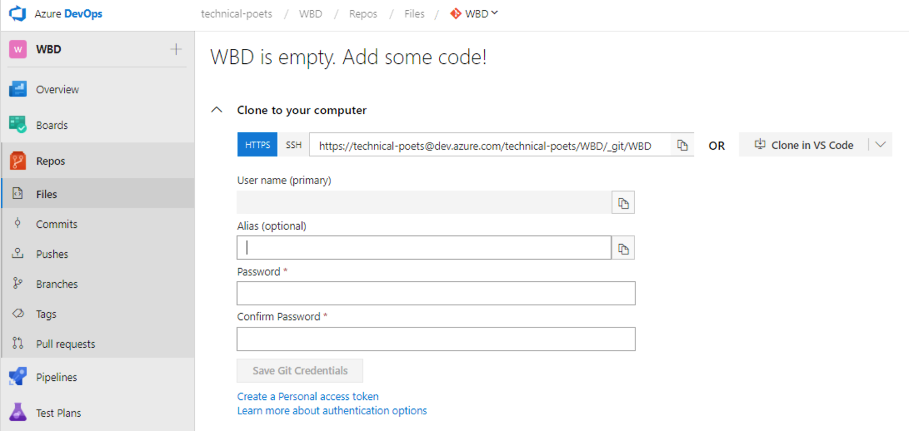
</div>

Now, we need to perform the following tasks:

- Clone the remote repository in the local repository path.
- Create a new source folder in the local repository path.
- Copy to the local repository path your bot's code from `source\1. start\` or `source\2. completed\` depending if you complete or not the laboratory.
- Commit the changes in the local repository.
- Push the changes in the remote repository.

Steps:

1. Open a terminal in the local repository path.

    ```bash
    C:/GitHub>git clone https://technical-poets@dev.azure.com/technical-poets/WBD/_git/WBD
    ```

2. Introduce your Azure DevOps credentials or your Git credentials.

3. After clone your remote repository you will be able to see the folder WBD inside GitHub.

4. Copy and paste the files from `source\1. start\` or `source\2. completed\` into C:\GitHub\WBD\, the files  depends if you complete or not the laboratory.

    <div style="text-align:center">
        
    </div>

5. In the terminal write:

    ```bash
    C:/GitHub/WBD>git add .
    ```

    ```bash
    C:/GitHub/WBD>git commit -a -m "Initial commit"
    ```

    ```bash
    C:/GitHub/WBD>git push
    ```

6. Once you pushed the changes to the remote repo, you will see the following message:

    ```bash
    Enumerating objects: 27, done.
    Counting objects: 100% (27/27), done.
    Delta compression using up to 4 threads.
    Compressing objects: 100% (23/23), done.
    Writing objects: 100% (27/27), 11.24 KiB | 1.41 MiB/s, done.
    Total 27 (delta 1), reused 0 (delta 0)
    remote: Analyzing objects... (27/27) (7 ms)
    remote: Storing packfile... done (54 ms)
    remote: Storing index... done (66 ms)
    To https://dev.azure.com/technical-poets/WBD/_git/WBD
    * [new branch]      master -> master
    ```

7. If you return to Azure DevOps portal in <b>Repos->Files</b>, you will be able to see the pushed files with Git.

    <div style="text-align:center">
        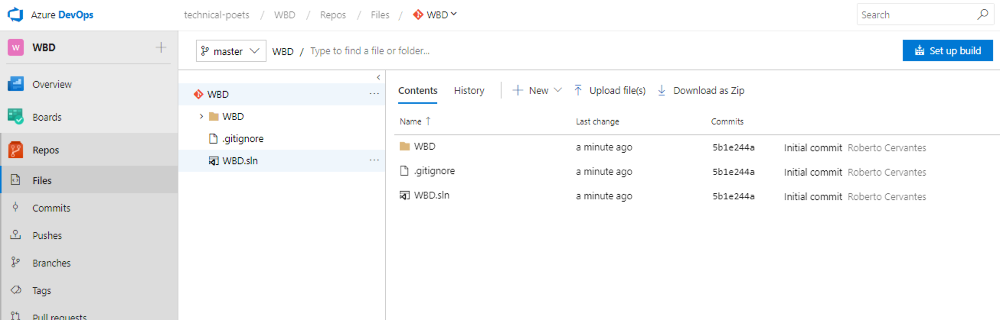
    </div>

#### Creating the CI pipeline

Now, it's time to configure the continuous integration pipeline. To perform this action click in <b>Pipelines->Builds</b> and then click `New pipeline`.

Steps:

1. Select the option: `Use the visual designer to create a pipeline without YAML`.

2. Select the current Azure Repos Git, the WBD team project, WBD repository and master branch then click continue.

    <div style="text-align:center">
        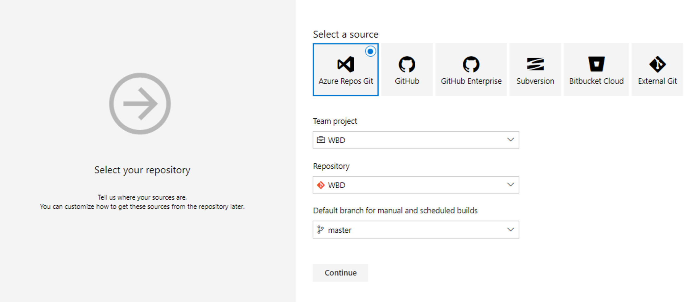
    </div>

3. Choose the following template: ASP.NET and click Apply.

    <div style="text-align:center">
        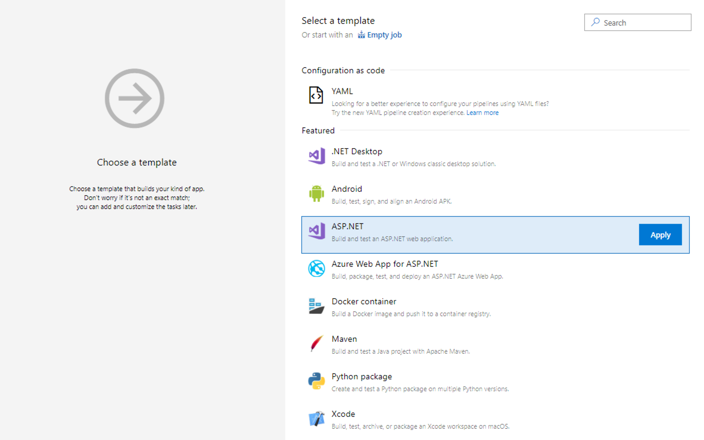
    </div>

4. Now, you will be able to see your CI pipeline complete, in this scenario you only need to `Enable continuous integration` in the Triggers tab and click save to save the CLI template.

    <div style="text-align:center">
        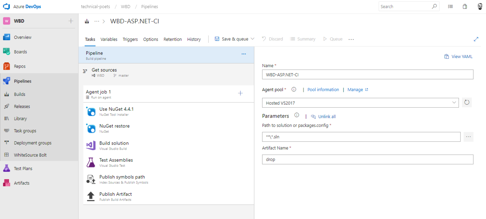
    </div>

5. Finally, you can `queue a new build` or `submit a new change in the code` to verify if the code is successfully compiled.

6. Click again in n <b>Pipelines->Builds</b> and you will see the current build in execution, if you want to see the details click in the commit name.

7. Let's validate that the build is compiled successfully.

    <div style="text-align:center">
        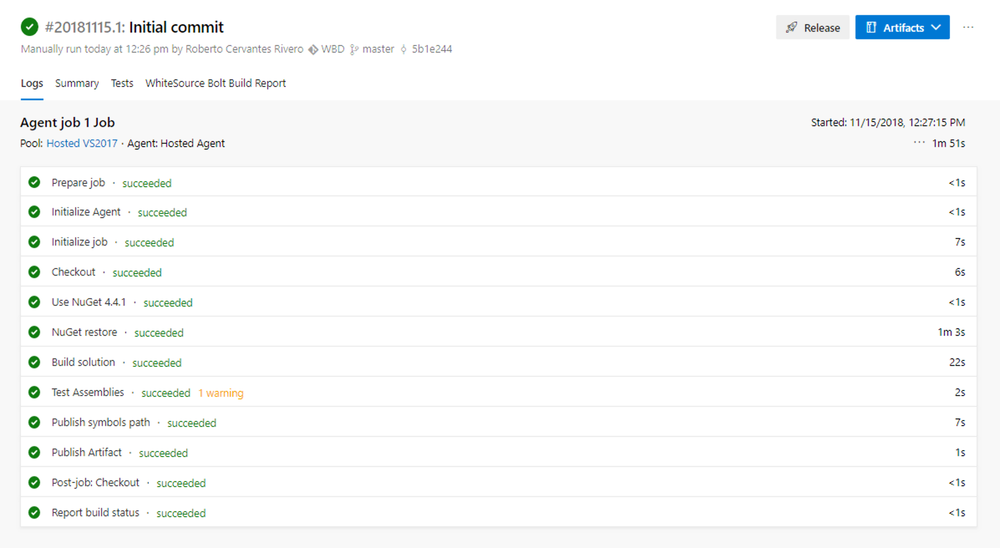
    </div>

8. Awesome, at this moment you have your first bot artifact ready to be deployed.

#### Creating the Web App Bot in Azure Portal

Go to https://portal.azure.com/ and get successfully sign-in with your Employee or Microsoft account.

Steps:

1. Create a Web App Bot resource with the following configuration:

    - Bot Name: wbd(uniqueid) e.g. wbd017.
    - Subscription: your subscription.
    - Resource Group: Create new with the same bot name, e.g. wbd017.
    - Location: region desired, e.g. West US.
    - Bot Template: SDK 3 / C# / Basic (we are going to override this bot with our code using SDK 4, I'm not using SDK 4 directly because it has a bot configuration file that is out of the scope of this walkthrough).
    - App Service Plan: Create new with the same bot name and location, e.g. App service plan name: wbd017 and location: West US.
    - Azure Storage: Create new.
    - Application Insights: Off.
    - Microsoft App Id and Password: Auto create.

2. Let's validate that the resources have been created successfully in the Azure portal.

    <div style="text-align:center">
        
    </div>

#### Creating the CD pipeline

Now, it's time to configure the continuous deployment pipeline. To perform this action click in <b>Pipelines->Releases</b> and then click `New pipeline`.

Steps:

1. Choose the following template: Azure App Service deployment and click Apply.

    <div style="text-align:center">
        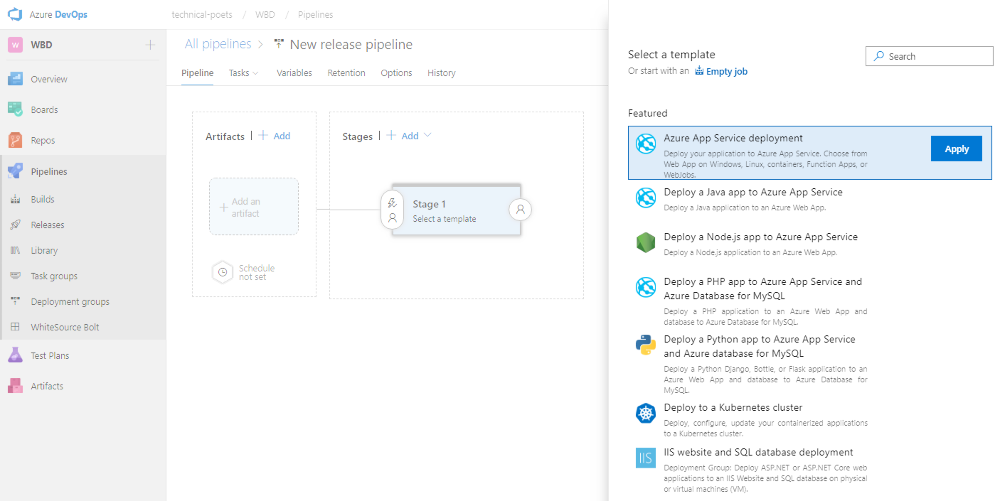
    </div>

2. Rename the Stage from `Stage 1` to `Azure Web App Bot`.

    <div style="text-align:center">
        
    </div>

3. Click in `Add an artifact` option and select the CI pipeline artifact configured previously then specify a source alias and click Add.

    <div style="text-align:center">
        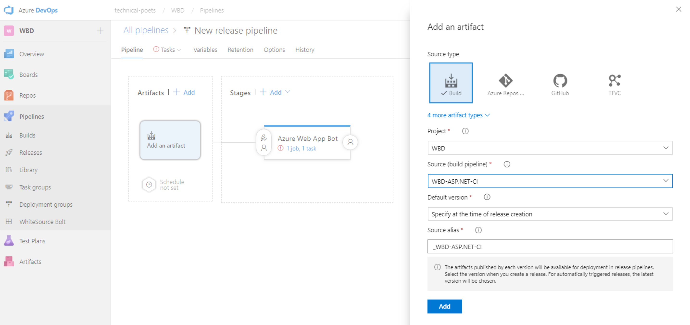
    </div>

4. Select the continuous deployment trigger and enable the option to create a release everytime there is a new build.

    <div style="text-align:center">
        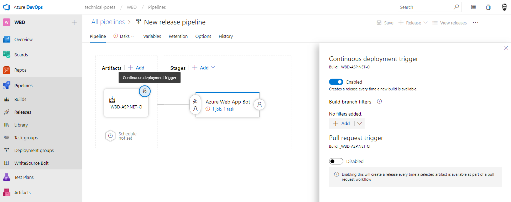
    </div>

5. Select Tasks tab and configure the following settings.

    - Azure Subscription (click Authorize to stablish connection with the account).
    - App Type: Web App
    - App service name: name of your Web App Bot (e.g. wbd017)

    <div style="text-align:center">
        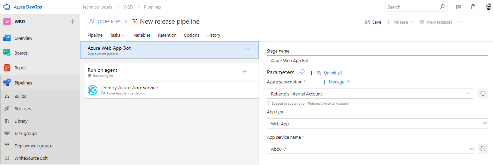
    </div>

6. Click in the add a new task icon and search: `Set App Service: Set App settings`. If it's the first time you use the plugin from the marketplace you need to install it, save you pipeline and then refresh the Azure DevOps page to be able to added in the pipeline.

    <div style="text-align:center">
        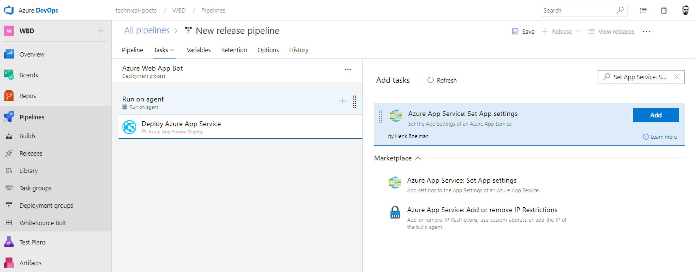
    </div>

7. Configure the Set App settings task with the following values.

    - TranslatorTextAPIKey='AZURE_TRANSLATOR_KEY'
    - BotVersion='BOT_VERSION'
    - LuisName01='LUIS_NAME (e.g. Reminders)'
    - LuisAppId01='LUIS_APPLICATION_ID'
    - LuisAuthoringKey01='LUIS_AUTHORING_KEY'
    - LuisEndpoint01='LUIS_ENDPOINT'

    <div style="text-align:center">
        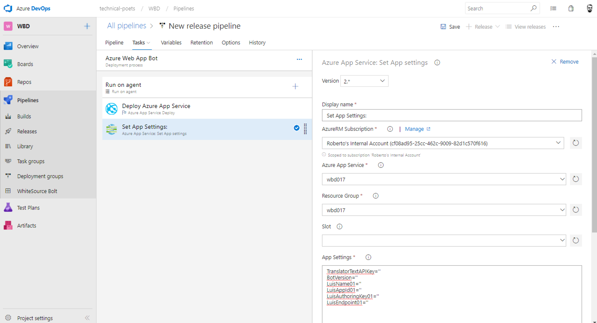
    </div>

8. Click in the add a new task icon and search: `Azure App Service Manage` and configure it to restart the app service.

    <div style="text-align:center">
        
    </div>

9. Save the release pipeline and queue a new build, if everything is correctly configured you will be able to see the deployment completed successfully in <b>Pipelines->Releases</b>.

    <div style="text-align:center">
        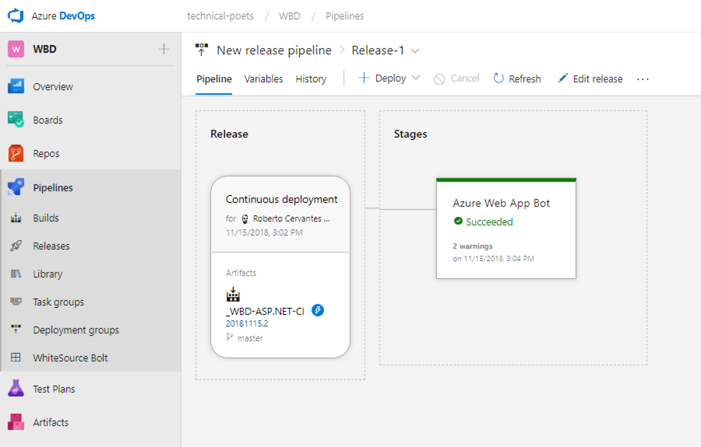
    </div>

10. You can validate the correct settings directly in the Azure portal.

    <div style="text-align:center">
        
    </div>

11. Congratulations!, you can now check your bot in the webchat window in the Azure portal.

    <div style="text-align:center">
        
    </div>