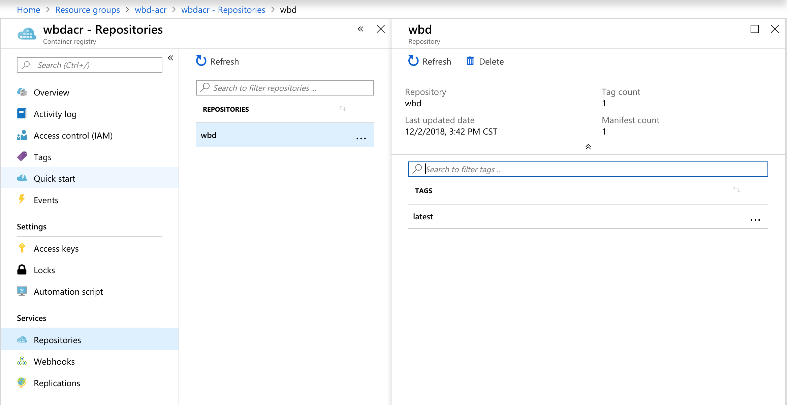
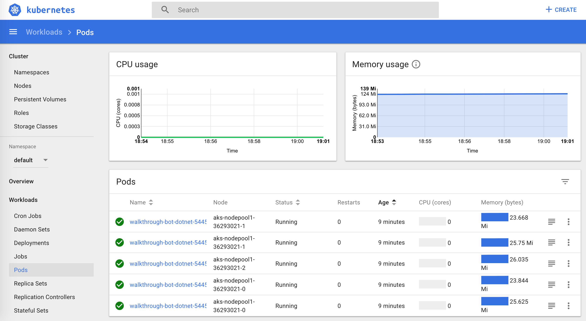
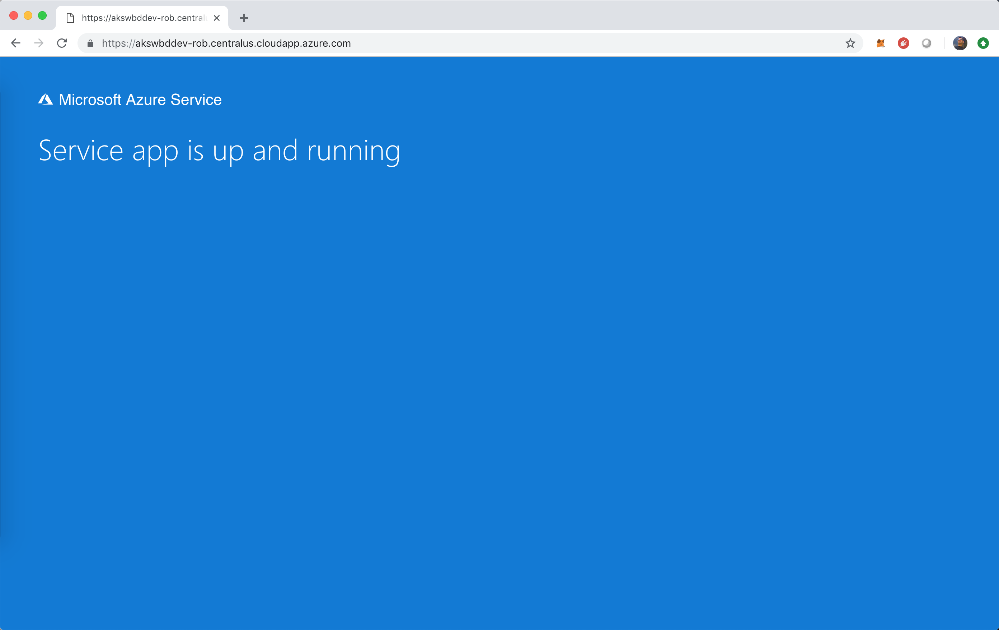
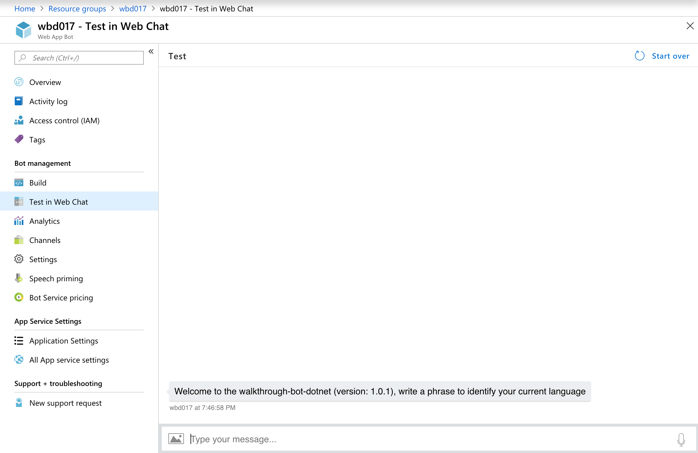

## Bot on Kubernetes

#### Installing Azure CLI

Azure CLI will be the hand tool for almost everything in this laboratory, let's download and configure it following the instructions here: https://docs.microsoft.com/en-us/cli/azure/install-azure-cli?view=azure-cli-latest.

Note: In some scenarios we can use the Bash terminal hosted in the Azure Portal, however there are some configurations for Kubernetes that requires a local machine configured with Azure CLI, that's why I decided to installed and configured from the beginning.

#### Installing Docker CE

Go to the Docker portal https://www.docker.com/get-started and install Docker in your local machine.

Docker will be used to build the images and push them to the ACR via CLI in the local machine, this is the preamble before start working with Kubernetes.

#### Azure Container Registry configuration

Once we have configured the Azure CLI, its time to open a terminal.

1. Let's login to Azure.

    ```bash
    az login
    ```

2. Display the accounts associated to your subscription.

    ```bash
    az account show
    ```

3. Select the account you want to use.

    ```bash
    az account set --subscription 
    ```

4. Let's create the resource group that we are going to use to allocate the ACR.

    ```bash
    az group create --name wbd-acr --location westus
    ```

5. Let's create the Azure Container Registry (ACR).

    ```bash
    az acr create --resource-group wbd-acr --name wbdacr --sku Basic --admin-enabled true
    ```

6. Get the credentials to access to the ACR.

    ```bash
    az acr credential show --resource-group wbd-acr --name wbdacr --output yaml
    ```

    * You should get something like this:

      ```yaml
      - name: password
        value: REAL_PASSWORD <-REAL PASSWORD SHOULD APPEAR HERE.
      - name: password2
        value: REAL_PASSWORD <-REAL PASSWORD SHOULD APPEAR HERE.
      username: wbdacr
      ```

7. Take note of the following, you will use information later.

    ```bash
    Username: wbdacr
    Password: REAL_PASSWORD
    Login Server: wbdacr.azurecr.io
    ```

#### Building Docker image in bot project

1. Ensure you have Docker running in your local machine, you have the latest version of the GitHub repo and you have successfully accomplished the [bot  programming laboratory](README-BotBuilderV4.md).

2. Let's backup the appsettings.json content in a notepad and then we are going to delete any settings. We are going to use the settings later.

    From this:

    ```json
    {
        "MicrosoftAppId": "MICROSOFT_BOT_APP_ID",
        "MicrosoftAppPassword": "MICROSOFT_BOT_APP_PASSWORD",
        "TranslatorTextAPIKey": "AZURE_TRANSLATOR_KEY",
        "BotVersion": "BOT_VERSION",
        "LuisName01": "LUIS_NAME (e.g. Reminders)",
        "LuisAppId01": "LUIS_APPLICATION_ID",
        "LuisAuthoringKey01": "LUIS_AUTHORING_KEY",
        "LuisEndpoint01": "LUIS_ENDPOINT"
    }
    ```

    To this:

    ```json
    {
    }
    ```

    <b>Why we delete whole settings?</b> We don't want to encapsulate the credentials in the container image, the image MUST be agnostic to every environment.

3. Open a terminal (as Administrator) pointing the folder `source\1. start\WBD\` folder and run the following command:

    ```json
    docker image build . --tag "latest"
    ```

    Wait until nuget packages are being reinstalled and the project finishes the build process (the project should be successfully compiled but is not ready to be executed).

    * You should be able to see something like this:

    ```bash
    Sending build context to Docker daemon  2.576MB
    Step 1/15 : FROM microsoft/dotnet:2.1.5-aspnetcore-runtime AS base
    ---> 84e946977e6f
    Step 2/15 : WORKDIR /app
    ---> Using cache
    ---> 9581dfa8f515
    Step 3/15 : EXPOSE 80
    ---> Using cache
    ---> f777b9570039
    Step 4/15 : FROM microsoft/dotnet:2.1.403-sdk AS build
    2.1.403-sdk: Pulling from microsoft/dotnet
    bc9ab73e5b14: Pull complete
    193a6306c92a: Pull complete
    e5c3f8c317dc: Pull complete
    a587a86c9dcb: Pull complete
    290de22a9506: Pull complete
    f378ac4c5856: Pull complete
    795266ce0809: Pull complete
    Digest: sha256:8e9138b0aebf298b78d299e09a32809fbe492e4a8d8cecf87f839b298309b2ed
    Status: Downloaded newer image for microsoft/dotnet:2.1.403-sdk
    ---> 6baac5bd0ea2
    Step 5/15 : WORKDIR /src
    ---> Running in 0f44907054af
    Removing intermediate container 0f44907054af
    ---> 59b3b40b383d
    Step 6/15 : COPY WBD.csproj ./
    ---> 62779ed59220
    Step 7/15 : RUN dotnet restore ./WBD.csproj
    ---> Running in 4d72e6cc74a9
      Restoring packages for /src/WBD.csproj...
      Installing System.Security.Principal.Windows 4.0.0.
      Installing System.Threading.Overlapped 4.0.1.
      Installing System.Threading.Overlapped 4.3.0.
      Installing System.Text.Encodings.Web 4.4.0.
      Installing Microsoft.AspNetCore.Http.Features 2.0.1.
      Installing System.Runtime.CompilerServices.Unsafe 4.4.0.
      Installing Microsoft.IdentityModel.Tokens 5.2.1.
      Installing Microsoft.IdentityModel.Logging 5.2.1.
      Installing System.Net.NetworkInformation 4.1.0.
      Installing System.Net.Requests 4.0.11.
      Installing System.Net.WebHeaderCollection 4.0.1.
      Installing System.Net.NetworkInformation 4.3.0.
      Installing System.Security.Principal 4.0.1.
      Installing System.Security.Claims 4.0.1.
      Installing runtime.native.System.Net.Security 4.0.1.
      Installing Microsoft.Recognizers.Text.NumberWithUnit 1.1.0.
      Installing Microsoft.Recognizers.Text 1.1.0.
      Installing Microsoft.VisualStudio.Azure.Containers.Tools.Targets 1.1.1.
      Installing Microsoft.Bot.Builder 4.0.8.
      Installing Microsoft.Bot.Builder.AI.QnA 4.0.8.
      Installing System.ValueTuple 4.4.0.
      Installing MongoDB.Driver 2.7.0.
      Installing StackExchange.Redis.StrongName 1.2.6.
      Installing Microsoft.Bot.Schema 4.0.8.
      Installing Microsoft.Bot.Builder.AI.Luis 4.0.8.
      Installing Microsoft.Bot.Connector 4.0.8.
      Installing MongoDB.Bson 2.7.0.
      Installing System.Diagnostics.DiagnosticSource 4.5.1.
      Installing Microsoft.Bot.Builder.Integration.AspNet.Core 4.0.8.
      Installing System.Security.Principal.Windows 4.5.1.
      Installing Microsoft.AspNetCore.All 2.1.5.
      Installing Microsoft.Recognizers.Text.Number 1.1.1.
      Installing Microsoft.Bot.Builder.Dialogs 4.0.8.
      Installing System.Runtime.CompilerServices.Unsafe 4.5.2.
      Installing MongoDB.Driver.Core 2.7.0.
      Installing Microsoft.AspNetCore.Http.Abstractions 2.0.1.
      Installing Microsoft.AspNetCore.Hosting.Server.Abstractions 2.0.1.
      Installing Microsoft.Extensions.FileProviders.Abstractions 2.0.0.
      Installing Microsoft.Extensions.DependencyInjection.Abstractions 2.0.0.
      Installing Microsoft.Bot.Builder.Azure 4.0.8.
      Installing Microsoft.Extensions.Hosting.Abstractions 2.0.1.
      Installing Cognitive.Face.Dotnet 1.0.2.
      Installing Microsoft.Extensions.Logging.Abstractions 2.0.0.
      Installing SourceLink.Create.CommandLine 2.8.1.
      Installing System.ComponentModel.TypeConverter 4.1.0.
      Installing System.Buffers 4.4.0.
      Installing Microsoft.Extensions.Primitives 2.0.0.
      Installing Microsoft.Win32.Registry 4.0.0.
      Installing Newtonsoft.Json 10.0.3.
      Installing System.Threading.ThreadPool 4.0.10.
      Installing System.Threading.Thread 4.0.0.
      Installing System.IdentityModel.Tokens.Jwt 5.2.1.
      Installing Microsoft.IdentityModel.Protocols 5.2.1.
      Installing Microsoft.Rest.ClientRuntime.Azure 3.3.13.
      Installing System.ComponentModel 4.0.1.
      Installing Microsoft.Azure.CognitiveServices.Language.LUIS.Runtime 2.0.0.
      Installing System.ComponentModel.Primitives 4.1.0.
      Installing Microsoft.Rest.ClientRuntime 2.3.13.
      Installing Microsoft.IdentityModel.Protocols.OpenIdConnect 5.2.1.
      Installing WindowsAzure.Storage 9.3.1.
      Installing System.Collections.NonGeneric 4.0.1.
      Installing System.Diagnostics.Process 4.1.0.
      Installing Microsoft.Extensions.Configuration 2.0.1.
      Installing Microsoft.Net.Http.Headers 2.0.1.
      Installing Microsoft.AspNetCore.Hosting.Abstractions 2.0.1.
      Installing Microsoft.AspNetCore 2.1.4.
      Installing Microsoft.AspNetCore.Authentication 2.1.2.
      Installing Microsoft.AspNetCore.Authentication.MicrosoftAccount 2.1.2.
      Installing Microsoft.AspNetCore.Identity.EntityFrameworkCore 2.1.3.
      Installing Microsoft.AspNetCore.Mvc 2.1.3.
      Installing Microsoft.AspNetCore.Identity 2.1.3.
      Installing Microsoft.Extensions.Identity.Stores 2.1.3.
      Installing Microsoft.AspNetCore.Authentication.Cookies 2.1.2.
      Installing Microsoft.Extensions.Caching.SqlServer 2.1.2.
      Installing Microsoft.AspNetCore.Authentication.Facebook 2.1.2.
      Installing Microsoft.Extensions.Identity.Core 2.1.3.
      Installing Microsoft.AspNetCore.Authentication.JwtBearer 2.1.2.
      Installing Microsoft.AspNetCore.CookiePolicy 2.1.2.
      Installing Microsoft.AspNetCore.Authentication.OAuth 2.1.2.
      Installing Microsoft.AspNetCore.Authorization.Policy 2.1.2.
      Installing Microsoft.AspNetCore.Mvc.Cors 2.1.3.
      Installing Microsoft.AspNetCore.Authentication.Twitter 2.1.2.
      Installing Microsoft.AspNetCore.Authentication.WsFederation 2.1.2.
      Installing Microsoft.AspNetCore.Mvc.Abstractions 2.1.3.
      Installing Microsoft.AspNetCore.Mvc.ApiExplorer 2.1.3.
      Installing Microsoft.AspNetCore.Http.Connections 1.0.4.
      Installing Microsoft.AspNetCore.Mvc.Analyzers 2.1.3.
      Installing Microsoft.AspNetCore.Authentication.Google 2.1.2.
      Installing Microsoft.AspNetCore.Mvc.Localization 2.1.3.
      Installing Microsoft.AspNetCore.Mvc.TagHelpers 2.1.3.
      Installing Microsoft.AspNetCore.Mvc.DataAnnotations 2.1.3.
      Installing Microsoft.AspNetCore.Http.Connections.Common 1.0.4.
      Installing Microsoft.AspNetCore.Mvc.Formatters.Xml 2.1.3.
      Installing Microsoft.AspNetCore.Mvc.RazorPages 2.1.3.
      Installing Microsoft.AspNetCore.Connections.Abstractions 2.1.3.
      Installing Microsoft.AspNetCore.Mvc.Razor 2.1.3.
      Installing Microsoft.AspNetCore.Razor.Runtime 2.1.2.
      Installing Microsoft.AspNetCore.Razor 2.1.2.
      Installing Microsoft.AspNetCore.Mvc.Formatters.Json 2.1.3.
      Installing System.IO.Pipelines 4.5.2.
      Installing Microsoft.AspNetCore.Authorization 2.1.2.
      Installing Microsoft.EntityFrameworkCore.Abstractions 2.1.4.
      Installing Microsoft.AspNetCore.Mvc.Razor.Extensions 2.1.2.
      Installing WindowsAzure.Storage 9.3.0.
      Installing Microsoft.AspNetCore.Razor.Language 2.1.2.
      Installing Microsoft.AspNetCore.Mvc.ViewFeatures 2.1.3.
      Installing Microsoft.EntityFrameworkCore.InMemory 2.1.4.
      Installing Microsoft.Extensions.Caching.Memory 2.1.2.
      Installing Microsoft.AspNetCore.SignalR.Protocols.Json 1.0.4.
      Installing Microsoft.EntityFrameworkCore.Sqlite.Core 2.1.4.
      Installing Microsoft.AspNetCore.SignalR 1.0.4.
      Installing Microsoft.AspNetCore.Server.Kestrel.Transport.Abstractions 2.1.3.
      Installing Microsoft.AspNetCore.Identity.UI 2.1.3.
      Installing Microsoft.AspNetCore.SignalR.Common 1.0.4.
      Installing Microsoft.CodeAnalysis.Razor 2.1.2.
      Installing Microsoft.AspNetCore.Server.Kestrel.Transport.Libuv 2.1.3.
      Installing Microsoft.EntityFrameworkCore.SqlServer 2.1.4.
      Installing Microsoft.Extensions.Caching.Abstractions 2.1.2.
      Installing Microsoft.AspNetCore.Server.Kestrel 2.1.3.
      Installing Microsoft.AspNetCore.Server.Kestrel.Transport.Sockets 2.1.3.
      Installing Microsoft.EntityFrameworkCore.Sqlite 2.1.4.
      Installing Microsoft.EntityFrameworkCore.Design 2.1.4.
      Installing Microsoft.EntityFrameworkCore.Relational 2.1.4.
      Installing Microsoft.AspNetCore.Authentication.OpenIdConnect 2.1.2.
      Installing Microsoft.AspNetCore.Server.IISIntegration 2.1.2.
      Installing Microsoft.AspNetCore.Server.Kestrel.Https 2.1.3.
      Installing Microsoft.EntityFrameworkCore.Tools 2.1.4.
      Installing Microsoft.AspNetCore.Server.Kestrel.Core 2.1.3.
      Installing Microsoft.EntityFrameworkCore.Analyzers 2.1.4.
      Installing Microsoft.AspNetCore.SignalR.Core 1.0.4.
      Installing Microsoft.AspNetCore.Mvc.Core 2.1.3.
      Installing Microsoft.Azure.DocumentDB.Core 1.9.1.
      Installing Microsoft.Extensions.Caching.Redis 2.1.2.
      Installing Microsoft.AspNetCore.SignalR.Redis 1.0.4.
      Installing Microsoft.EntityFrameworkCore 2.1.4.
      Installing System.Collections.Immutable 1.4.0.
      Installing Microsoft.Recognizers.Text 1.1.1.
      Installing Microsoft.Recognizers.Text.Choice 1.1.0.
      Installing Microsoft.Recognizers.Text.DateTime 1.1.0.
      Installing System.Threading.Tasks.Extensions 4.4.0.
      Installing DnsClient 1.0.7.
      Installing System.Net.Security 4.0.0.
      Installing System.Collections.Specialized 4.0.1.
      Installing System.Security.SecureString 4.0.0.
      Installing System.Diagnostics.TraceSource 4.0.0.
      Generating MSBuild file /src/obj/WBD.csproj.nuget.g.props.
      Generating MSBuild file /src/obj/WBD.csproj.nuget.g.targets.
      Restore completed in 9.81 sec for /src/WBD.csproj.
    Removing intermediate container 4d72e6cc74a9
    ---> 64ef96f12f87
    Step 8/15 : COPY . .
    ---> fa3a739c314b
    Step 9/15 : RUN dotnet build WBD.csproj -c Release -o /app
    ---> Running in 2ba4a47fead6
    Microsoft (R) Build Engine version 15.8.169+g1ccb72aefa for .NET Core
    Copyright (C) Microsoft Corporation. All rights reserved.

      Restoring packages for /src/WBD.csproj...
      Generating MSBuild file /src/obj/WBD.csproj.nuget.g.props.
      Generating MSBuild file /src/obj/WBD.csproj.nuget.g.targets.
      Restore completed in 971.77 ms for /src/WBD.csproj.
      WBD -> /app/WBD.dll

    Build succeeded.
        0 Warning(s)
        0 Error(s)

    Time Elapsed 00:00:05.37
    Removing intermediate container 2ba4a47fead6
    ---> 8ad579d146b0
    Step 10/15 : FROM build AS publish
    ---> 8ad579d146b0
    Step 11/15 : RUN dotnet publish WBD.csproj -c Release -o /app
    ---> Running in f6b80d30bbf4
    Microsoft (R) Build Engine version 15.8.169+g1ccb72aefa for .NET Core
    Copyright (C) Microsoft Corporation. All rights reserved.

      Restore completed in 54.84 ms for /src/WBD.csproj.
      WBD -> /src/bin/Release/netcoreapp2.1/WBD.dll
      WBD -> /app/
    Removing intermediate container f6b80d30bbf4
    ---> 4dd4fd6f3afc
    Step 12/15 : FROM base AS final
    ---> f777b9570039
    Step 13/15 : WORKDIR /app
    ---> Running in 90d7b5358971
    Removing intermediate container 90d7b5358971
    ---> 402205bc3e14
    Step 14/15 : COPY --from=publish /app .
    ---> 1c3d427c6fdb
    Step 15/15 : ENTRYPOINT ["dotnet", "WBD.dll"]
    ---> Running in 37f981f3ccfb
    Removing intermediate container 37f981f3ccfb
    ---> 8daa1a9317c3
    Successfully built 8daa1a9317c3
    Successfully tagged latest:latest
    SECURITY WARNING: You are building a Docker image from Windows against a non-Windows Docker host. All files and directories added to build context will have '-rwxr-xr-x' permissions. It is recommended to double check and reset permissions for sensitive files and directories.
    ```

4. Let's login to ACR.

    ```bash
    docker login wbdacr.azurecr.io --username wbdacr --password REAL_PASSWORD
    ```

5. Create an alias of the image.

    Note: If you notice at the end of the build log we have a `Successfully built 8daa1a9317c3` message, that identificator means the IMAGE ID of the application.

    Let's apply an alias in the ACR.

    ```bash
    docker tag 8daa1a9317c3 wbdacr.azurecr.io/wbd
    ```

6. Push the image to the ACR.

    ```bash
    docker push wbdacr.azurecr.io/wbd
    ```

    * You should be able to see something like this:

    ```bash
    The push refers to repository [wbdacr.azurecr.io/wbd]
    32036fcc5590: Pushed
    3aa5075795e2: Pushed
    5d579c33053b: Pushed
    8b1e393851d9: Pushed
    799e74090312: Pushed
    237472299760: Pushed
    latest: digest: sha256:eda6bb817045e00fa9a879eae328d151c7f25e69829fa400b968289c9bb52747 size: 1581
    ```

7. Congratulations, if you go to your Azure Portal, in your ACR repositories, you will be able to see the image pushed.

    <div style="text-align:center">
        
    </div>

#### Creating Kubernetes cluster using Kubernetes Service

1. Let's create the resource group that we are going to use to allocate the Kubernetes cluster.

    ```bash
    az group create --name akswbd --location centralus
    ```

    Note: There's a reason to use Central US since there is a VM size special for this scenario: B2s.

2. Let's create the Azure Kubernetes Service (AKS).

    ```bash
    az aks create --name akswbddev --resource-group akswbd --node-count 3 --disable-rbac --generate-ssh-keys --location centralus --node-vm-size Standard_B2s
    ```

    It will take a couple of minutes to create a new cluster called `akswbddev` in the `akswbd` resource group with `three nodes` of size `Standard_B2s` in the region `central us` with the `RBAC disabled`.

    * You should be able to see something like this:

    ```bash
    {
      "aadProfile": null,
      "addonProfiles": null,
      "agentPoolProfiles": [
        {
          "count": 3,
          "maxPods": 110,
          "name": "nodepool1",
          "osDiskSizeGb": 30,
          "osType": "Linux",
          "storageProfile": "ManagedDisks",
          "vmSize": "Standard_B2s",
          "vnetSubnetId": null
        }
      ],
      "dnsPrefix": "akswbddev-akswbd-cf08ad",
      "enableRbac": false,
      "fqdn": "akswbddev-akswbd-cf08ad-d2513ac3.hcp.centralus.azmk8s.io",
      "id": "/subscriptions/cf08ad95-25cc-462c-9009-82d1c570f616/resourcegroups/akswbd/providers/Microsoft.ContainerService/managedClusters/akswbddev",
      "kubernetesVersion": "1.9.11",
      "linuxProfile": {
        "adminUsername": "azureuser",
        "ssh": {
          "publicKeys": [
            {
              "keyData": "ssh-rsa AAAAB3NzaC1yc2EAAAADAQABAAABAQDd1+vqO/ajdHNwMMhqp6UEkmR9fu8oGrTVNudLYxoXG4Xt4xvFxew5Rm3FbtWh/FXs8qO8vCbcSBNeSmQGzaSY1/RvMVH+IIeMtF5xo10O7aBqjpcVuO46vo3a+BPOXVuuxZ7V1sH6kJuPf79kvq26h+kZT1z2avV7yrUlbOGnOh/45cKgOwKkg2uAFB5yLOsIfbK39uYI4Po5squvAW5RZGFQz9e3Qp/oEeXYj/JflWz/8sO7ufjKSbL+RaJF6S8KcvzbxdUXZ0OTTicivOsQ7/embgcDj6PtL0AOebhNZsQnRqF5SdDJ4bsi16SdYJBM0kBRboSVsM4Fze6N/4Dx"
            }
          ]
        }
      },
      "location": "centralus",
      "name": "akswbddev",
      "networkProfile": {
        "dnsServiceIp": "10.0.0.10",
        "dockerBridgeCidr": "172.17.0.1/16",
        "networkPlugin": "kubenet",
        "networkPolicy": null,
        "podCidr": "10.244.0.0/16",
        "serviceCidr": "10.0.0.0/16"
      },
      "nodeResourceGroup": "MC_akswbd_akswbddev_centralus",
      "provisioningState": "Succeeded",
      "resourceGroup": "akswbd",
      "servicePrincipalProfile": {
        "clientId": "84d52ee3-43c5-4d20-9cf9-5862edc3e704",
        "secret": null
      },
      "tags": null,
      "type": "Microsoft.ContainerService/ManagedClusters"
    }
    ```

3. Great, at this moment your cluster is ready to be used.

4. It's time to download and install the AKS CLI, open a terminal and execute the following command.

    ```bash
    az aks install-cli
    ```

5. Let's get the credentials

    ```bash
    az aks get-credentials --resource-group akswbd --name akswbddev
    ```

6. Let's give permission to your dashboard using the `az aks cli`.

    ```bash
    kubectl create clusterrolebinding kubernetes-dashboard -n kube-system --clusterrole=cluster-admin --serviceaccount=kube-system:kubernetes-dashboard
    ```

7. You can now open a new terminal and browse in the Kubernetes Portal.

    ```bash
    az aks browse --resource-group akswbd --name akswbddev
    ```

    <div style="text-align:center">
        
    </div>

    In this portal you can configure and explore the health of your nodes, deployments, etc.

8. It's time to create the Docker configuration secret in Kubernetes with the name: `acr-auth`, this secret will contain all the information required to pull the images from the ACR.

    ```bash
    kubectl create secret docker-registry acr-auth --docker-server wbdacr.azurecr.io --docker-username wbdacr --docker-password REAL_PASSWORD --docker-email YOURDOCKER@EMAIL.com
    ```

9. Now, create a temporal folder `akswbddev` and create a new json file: `appsettings.secrets.json`.

    * This file must contain the following:

    ```json
    {
        "MicrosoftAppId": "MICROSOFT_BOT_APP_ID",
        "MicrosoftAppPassword": "MICROSOFT_BOT_APP_PASSWORD",
        "TranslatorTextAPIKey": "AZURE_TRANSLATOR_KEY",
        "BotVersion": "BOT_VERSION",
        "LuisName01": "LUIS_NAME (e.g. Reminders)",
        "LuisAppId01": "LUIS_APPLICATION_ID",
        "LuisAuthoringKey01": "LUIS_AUTHORING_KEY",
        "LuisEndpoint01": "LUIS_ENDPOINT"
    }
    ```

    MicrosoftAppId and MicrosoftAppPassword are required and can be obtain from the Web App Bot, if you don't know how to create a Web App Bot review the laboratory: [Adding CI/CD pipelines to the Bot using Azure DevOps](README-AzDevOps.md).

10. Open a terminal in the folder `akswbddev` and create the secret.

    ```bash
    kubectl create secret generic secret-appsettings-akswbddev --from-file=appsettings.secrets.json
    ```

11. In the same temporal folder `akswbddev` create a new json file: `deployment.yaml`.

    * This file must contain the following:

    ```yaml
    apiVersion: extensions/v1beta1
    kind: Deployment
    metadata:
      name: walkthrough-bot-dotnet
    spec:
      replicas: 5
      template:
        metadata:
          labels:
            app: walkthrough-bot-dotnet
        spec:
          containers:
          - name: walkthrough-bot-dotnet
            image: wbdacr.azurecr.io/wbd:latest
            ports:
            - containerPort: 80
            env:
            - name: "ASPNETCORE_ENVIRONMENT"
              value: "Kubernetes"
            volumeMounts:
            - name: secrets
              mountPath: /app/secrets
              readOnly: true
          imagePullSecrets:
            - name: acr-auth
          volumes:
          - name: secrets
            secret:
              secretName: secret-appsettings-akswbddev
    ```

    This file is responsible to create the deployment, you can see with detail how many replicas (instances) will have the deployment, the secret used for pulling the image and the secret for appsettings.

12. Let's execute the yaml definition.

    ```bash
    kubectl apply -f deployment.yaml
    ```

    If you have open your Kubernetes portal you can see in Pods tab, the instances running in the cluster.

    <div style="text-align:center">
        
    </div>

13. Awesome!! You have deployed your bot image in the cluster, now instances are correctly configured, but there is a little issue, this hasn't been exposed to internet, we only have a bunch of isolated instances running in the cluster.

    <b>Note:</b> Remember, the Azure Web App Bot is pointing to the HTTPS endpoint exposed by the App Service, our goal is replicate the HTTPS endpoint with a external and secure load balancer in Kubernetes to allow Web App Bot reach the logic of the bot.

14. It's time to secure the http binding, to perform this task we need to create an HTTPS ingress controller using HELM, it's important to mention that I had some issues using HELM 2.12.0, I suggest force the HELM installation to use the version: 2.11.0, the issue is already documented here: https://github.com/MicrosoftDocs/azure-docs/issues/21067.

    Installing HELM: 

    - For Windows: https://github.com/helm/helm/releases/tag/v2.11.0
    - For mac: 

        If it's the first time you install it:

        ```bash
        brew install https://raw.githubusercontent.com/Homebrew/homebrew-core/ee94af74778e48ae103a9fb080e26a6a2f62d32c/Formula/kubernetes-helm.rb
        ```

        If you had issues because you already installed the version 2.12.0 or 2.12.1.

        ```bash
        brew unlink kubernetes-helm  
        brew uninstall kubernetes-helm --force
        brew install https://raw.githubusercontent.com/Homebrew/homebrew-core/ee94af74778e48ae103a9fb080e26a6a2f62d32c/Formula/kubernetes-helm.rb
        ```

    If you have doubts, take a look here: https://docs.helm.sh/using_helm/#installing-helm.

15. Initialize Helm and Tiller.

    ```bash
    helm init
    ```

16. Validate the version of HELM:

    ```bash
    helm version
    ```

    You should see something like this:

    ```bash
    Client: &version.Version{SemVer:"v2.11.0", GitCommit:"2e55dbe1fdb5fdb96b75ff144a339489417b146b", GitTreeState:"clean"}
    Server: &version.Version{SemVer:"v2.11.0", GitCommit:"2e55dbe1fdb5fdb96b75ff144a339489417b146b", GitTreeState:"clean"}
    ```

    <b>Note:</b> You can see that Client and Server version are: 2.11.0.

    In case you have an issue looking inconsistencies, try doing next:
    
    ```bash
    helm reset --force
    helm init
    helm version
    ```

17. Let's install the nginx-ingress and certificate manager with helm.

    ```bash
    helm install stable/nginx-ingress --namespace kube-system --set controller.replicaCount=2 --set rbac.create=false
    ```

    ```bash
    helm install stable/cert-manager --namespace kube-system --set ingressShim.defaultIssuerName=letsencrypt-prod --set ingressShim.defaultIssuerKind=ClusterIssuer --set rbac.create=false --set serviceAccount.create=false
    ```

    <b>Note:</b> In case you have any problem with the packages, you can use: `helm list` and `helm delete --purge [package]` to delete the package from kubernetes.

18. You can see the ingress controllers instances.

    ```bash
    kubectl get service -l app=nginx-ingress --namespace kube-system
    ```

    If you see EXTERNAL-IP with status pending wait one or two minutes until it receives the assigned public IP.

    ```bash
    NAME                                    TYPE           CLUSTER-IP     EXTERNAL-IP   PORT(S)                      AGE
    fun-hog-nginx-ingress-controller        LoadBalancer   10.0.45.63     <pending>     80:32677/TCP,443:32295/TCP   11s
    fun-hog-nginx-ingress-default-backend   ClusterIP      10.0.183.229   <none>        80/TCP                       11s
    ```

    <b>Note:</b> It's important to keep save the external ip address, we are going to use it in the next step.

19. Let's create a public unique DNS alias with the following structure: wbd-aks-{alias}, e.g. wbd-aks-rcervantes.

    <b>Note:</b> It's important to keep save the public unique DNS alias, we are going to use it in the following steps.

20. In the same temporal folder `akswbddev` create a new bash file: `deployment.sh`, add the external-ip address assigned by the nginx-ingress controller and add the public unique DNS alias.

    ```bash
    #!/bin/bash

    # Public IP address of your ingress controller
    IP="ADD THE INGRESS EXTERNAL IP ADDRESS"

    # Name to associate with public IP address
    DNSNAME="ADD THE PUBLIC UNIQUE DNS ALIAS"

    # Get the resource-id of the public ip
    PUBLICIPID=$(az network public-ip list --query "[?ipAddress!=null]|[?contains(ipAddress, '$IP')].[id]" --output tsv)

    # Update public ip address with DNS name
    az network public-ip update --ids $PUBLICIPID --dns-name $DNSNAME
    ```

21. Then execute the bash file.

    ```bash
    sh ./deployment.sh
    ```
    * You should be able to see something like this:

    ```bash
    {
      "dnsSettings": {
        "domainNameLabel": "wbd-aks-ingress",
        "fqdn": "wbd-aks-ingress.centralus.cloudapp.azure.com",
        "reverseFqdn": null
      },
      "etag": "W/\"8629ef7e-f798-480d-a9e1-72f956389097\"",
      "id": "/subscriptions/cf08ad95-25cc-462c-9009-82d1c570f616/resourceGroups/MC_akswbd_akswbddev_centralus/providers/Microsoft.Network/publicIPAddresses/kubernetes-a60fc1e8cf69811e8b71c4675dfeb33b",
      "idleTimeoutInMinutes": 4,
      "ipAddress": "104.43.251.18",
      "ipConfiguration": {
        "etag": null,
        "id": "/subscriptions/cf08ad95-25cc-462c-9009-82d1c570f616/resourceGroups/MC_akswbd_akswbddev_centralus/providers/Microsoft.Network/loadBalancers/kubernetes/frontendIPConfigurations/a60fc1e8cf69811e8b71c4675dfeb33b",
        "name": null,
        "privateIpAddress": null,
        "privateIpAllocationMethod": null,
        "provisioningState": null,
        "publicIpAddress": null,
        "resourceGroup": "MC_akswbd_akswbddev_centralus",
        "subnet": null
      },
      "ipTags": [],
      "location": "centralus",
      "name": "kubernetes-a60fc1e8cf69811e8b71c4675dfeb33b",
      "provisioningState": "Succeeded",
      "publicIpAddressVersion": "IPv4",
      "publicIpAllocationMethod": "Static",
      "publicIpPrefix": null,
      "resourceGroup": "MC_akswbd_akswbddev_centralus",
      "resourceGuid": "7fc6f0e9-8830-4aad-a3e6-8919cf10781d",
      "sku": {
        "name": "Basic",
        "tier": "Regional"
      },
      "tags": {
        "service": "kube-system/fun-hog-nginx-ingress-controller"
      },
      "type": "Microsoft.Network/publicIPAddresses",
      "zones": null
    }
    ```

22. In the same temporal folder `akswbddev` create the certificate cluster issuer yaml file: `cluster-issuer.yaml`.

    ```yaml
    apiVersion: certmanager.k8s.io/v1alpha1
    kind: ClusterIssuer
    metadata:
      name: letsencrypt-prod
    spec:
      acme:
        server: https://acme-v02.api.letsencrypt.org/directory
        email: user@contoso.com
        privateKeySecretRef:
          name: letsencrypt-prod
        http01: {}
    ```

23. Let's execute the yaml definition.

    ```bash
    kubectl apply -f cluster-issuer.yaml
    ```

24. In the same temporal folder `akswbddev` create the certificate yaml file: `certificate.yaml`, add the public unique DNS alias and the cluster region.

    ```yaml
    apiVersion: certmanager.k8s.io/v1alpha1
    kind: Certificate
    metadata:
      name: certificate
    spec:
      secretName: certificate
      dnsNames:
      - {ADD PUBLIC UNIQUE DNS ALIAS}.{ADD CLUSTER REGION e.g. centralus}.cloudapp.azure.com
      acme:
        config:
        - http01:
            ingressClass: nginx
          domains:
          - {ADD PUBLIC UNIQUE DNS ALIAS}.{ADD CLUSTER REGION e.g. centralus}.cloudapp.azure.com
      issuerRef:
        name: letsencrypt-prod
        kind: ClusterIssuer
    ```

25. Let's execute the yaml definition.

    ```bash
    kubectl apply -f certificate.yaml
    ```

26. In the same temporal folder `akswbddev` create the ingress route yaml file: `ingress-route.yaml` add the public unique DNS alias and the cluster region.

    ```yaml
    apiVersion: extensions/v1beta1
    kind: Ingress
    metadata:
      name: ingress-route
      annotations:
        kubernetes.io/ingress.class: nginx
        certmanager.k8s.io/cluster-issuer: letsencrypt-prod
        nginx.ingress.kubernetes.io/rewrite-target: /
    spec:
      tls:
      - hosts:
        - {ADD PUBLIC UNIQUE DNS ALIAS}.{ADD CLUSTER REGION e.g. centralus}.cloudapp.azure.com
        secretName: certificate
      rules:
      - host: {ADD PUBLIC UNIQUE DNS ALIAS}.{ADD CLUSTER REGION e.g. centralus}.cloudapp.azure.com
        http:
          paths:
          - path: /
            backend:
              serviceName: walkthrough-bot-dotnet
              servicePort: 80
    ```

27. Let's execute the yaml definition.

    ```bash
    kubectl apply -f ingress-route.yaml
    ```

28. Now let's expose the deployment to internet.

    ```bash
    kubectl expose deployment walkthrough-bot-dotnet --name=walkthrough-bot-dotnet
    ```

29. If you do the previous steps correctly you will be able to access with a valid HTTPS certificate in your browser: `https://{PUBLIC UNIQUE DNS ALIAS}.{ADD CLUSTER REGION e.g. centralus}.cloudapp.azure.com`.

    <div style="text-align:center">
        
    </div>

    <b>Note:</b> In case something goes wrong you can use the following commands to delete your Kubernetes resources, verify them and try again.

    - kubectl delete -f certificate.yaml
    - kubectl delete -f cluster-issuer.yaml
    - kubectl delete -f ingress-route.yaml

30. Now it's simple, you can go to your Web App Bot Settings replace the App Service url with the Kubernetes exposed service https url and save the changes.

  <div style="text-align:center">
      
  </div>

31. Bang!! You are now running the Bot in a cluster of 5 instances in Kubernetes.

  <div style="text-align:center">
      
  </div>